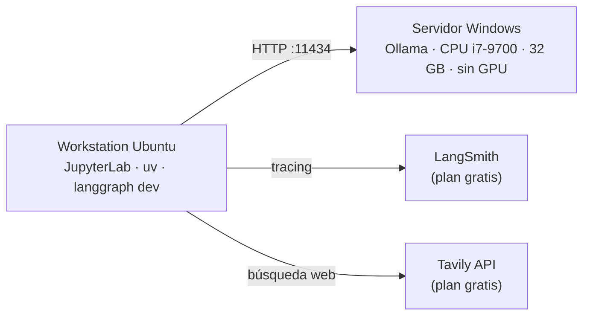

# LangChain Academy en local: el camino a la certificación LCAE con Ollama

> **EN:** Fork of LangChain Academy's *Introduction to LangChain (Python)* adapted to run **100 % locally on CPU with Ollama** (no paid LLM APIs). Each lesson is documented with what broke, why, and how it was fixed — practical evidence of my path to the **LangChain Certified Agent Engineer (LCAE)** certification.

Este repositorio es un fork del curso oficial [`langchain-ai/lca-lc-foundations`](https://github.com/langchain-ai/lca-lc-foundations) (licencia MIT). Lo adapté para correr **todos los notebooks con modelos locales en Ollama, sin GPU y sin APIs de pago**. Cada lección queda documentada como evidencia práctica: qué se rompió, por qué y cómo lo resolví.

**Autor:** Gino. Ingeniero de telecomunicaciones (optimización RAN/RF) en transición a ingeniería de IA y agentes.
<!-- LinkedIn: agrega aquí tu URL -->

---

## 🎯 Objetivo

Prepararme para la **LangChain Certified Agent Engineer (LCAE)**, cuyo examen evalúa 4 dominios (Build, Test, Deploy, Monitor), aprendiendo con restricciones reales:

- **Sin APIs de pago.** Los modelos corren en un servidor propio con Ollama.
- **Sin GPU.** Todo en CPU, así que la latencia y los tokens importan y se miden.
- **Documentación de cada problema** con el formato *problema → causa → solución → regla*.

Ver la [guía del examen](docs/examen-lcae.md).

## 🖥️ Arquitectura del lab



| Pieza | Uso |
|---|---|
| [`local_model.py`](local_model.py) | `get_model()` reemplaza a `init_chat_model("gpt-5-nano")` en todos los notebooks |
| Ollama | `gemma4:latest` (texto, tools, visión y audio), `qwen3:8b`, `qwen3:4b`, `gemma3:4b` |
| LangSmith | Tracing de cada ejecución (dominio Monitor) |
| Tavily | Tool de búsqueda web |

Detalle completo en [docs/setup-lab-local.md](docs/setup-lab-local.md).

## 📈 Progreso

| Curso / Módulo | Lección | Estado | Notas |
|---|---|---|---|
| **01 · Introduction to LangChain** | M1.1 Foundational Models | ✅ | [nota](docs/module-1/M1.1-foundational-models.md) |
| | M1.2 Prompting | ✅ | [nota](docs/module-1/M1.2-prompting.md) |
| | M1.3 Tools | ✅ | [nota](docs/module-1/M1.3-tools.md) |
| | M1.4 Web Search | ✅ | [nota](docs/module-1/M1.4-web-search.md) |
| | M1.5 Memory | ✅ | [nota](docs/module-1/M1.5-memory.md) |
| | M1.6 Multimodal (imagen + audio) | ✅ | [nota](docs/module-1/M1.6-multimodal.md) |
| | M1.7 Personal Chef (proyecto + LangGraph Studio) | ✅ | [nota](docs/module-1/M1.7-personal-chef.md) |
| | M2.1 MCP (servidor propio + servidor de terceros) | ✅ | [nota](docs/module-2/M2.1-mcp.md) |
| | M2.1b Travel Agent (MCP remoto Kiwi.com) | ✅ | [nota](docs/module-2/M2.1b-travel-agent.md) |
| | M2.2a Runtime Context | ✅ | [nota](docs/module-2/M2.2a-runtime-context.md) |
| | M2.2b State | ✅ | [nota](docs/module-2/M2.2b-state.md) |
| | M2.3 Multi-Agent (subagents as tools) | ✅ | [nota](docs/module-2/M2.3-multi-agent.md) |
| | M2.4 Wedding Planner (proyecto: 3 subagentes + state + MCP + SQL) | ✅ parcial | [nota](docs/module-2/M2.4-wedding-planner.md) |
| | Módulo 2: bonus RAG y SQL (adaptados, por correr) | ⏳ | |
| | Módulo 3: production-ready agent | ⬜ | |
| 02 · Introduction to Deep Agents | | ⬜ | |
| 03 · Building Reliable Agents (Test) | | ⬜ | |
| 04 · Monitoring Production Agents | | ⬜ | |
| 05 · LangSmith Deployment | | ⬜ | |
| 06 · LCAE Practice Exam → **Examen** | | ⬜ | |

El registro cronológico está en la [bitácora](docs/bitacora.md).

## 🔬 Hallazgos medidos en el lab (CPU, sin GPU)

| Hallazgo | Dato real | Lección |
|---|---|---|
| El *thinking* de qwen3 en CPU es carísimo | ~5,7 tokens/s → hay que usar `reasoning=False` | [M1.1](docs/module-1/M1.1-foundational-models.md) |
| La salida de las tools es latencia | 5 resultados de Tavily ≈ 2.000 tokens ≈ 60 s solo leyendo | [M1.4](docs/module-1/M1.4-web-search.md) |
| Sin tool, el modelo inventa con seguridad | Dijo un presidente de Colombia equivocado; con búsqueda acertó | [M1.4](docs/module-1/M1.4-web-search.md) |
| La memoria reenvía el historial | Tokens de entrada 22 → 91 en el segundo turno | [M1.5](docs/module-1/M1.5-memory.md) |
| Capacidad del modelo ≠ soporte de la integración | gemma4 oye audio, pero `langchain-ollama` rechaza bloques `audio`. Lo resolví con audio a 16 kHz | [M1.6](docs/module-1/M1.6-multimodal.md) |
| Un modelo multimodal alucina con entrada vacía | Con el micrófono mudo "transcribió" frases que nadie dijo | [M1.6](docs/module-1/M1.6-multimodal.md) |
| gemma4 es el más rápido del lab para agentes | ~10,8 tok/s generando frente a ~5,7 de qwen3:8b | [M1.7](docs/module-1/M1.7-personal-chef.md) |
| El prompt es la palanca más barata de latencia | Limitar la salida y `max_results=3`: 107,9 s → 31,8 s y 863 → 220 tokens, y además cita fuentes | [M1.7](docs/module-1/M1.7-personal-chef.md) |
| Contexto desbordado: el modelo "olvida" la pregunta | Kiwi + historial > 8.192 tokens → el modelo preguntó "¿ciudad de origen?"; con 32K respondió bien (9.866 tokens en un paso) | [M2.1b](docs/module-2/M2.1b-travel-agent.md) |
| La tool funciona pero el usuario no recibe respuesta | gemma4 actualizó y leyó el state bien, pero su último mensaje llegó vacío (1 token) | [M2.2b](docs/module-2/M2.2b-state.md) |
| Status *success* ≠ resultado correcto | El Wedding Planner terminó sin errores, pero el subagente de vuelos pidió la fecha en vez de buscar (Kiwi la exige) | [M2.4](docs/module-2/M2.4-wedding-planner.md) |

**Evidencia: el agente del módulo 1 corriendo en LangGraph Studio con gemma4 local**


Servidores MCP usados y lo que exponen: [docs/mcp-catalog.md](docs/mcp-catalog.md) · Todas las reglas consolidadas: [docs/lecciones-aprendidas.md](docs/lecciones-aprendidas.md) · Observabilidad: [docs/langsmith-tracing-monitor.md](docs/langsmith-tracing-monitor.md)

## 🔧 Qué cambia respecto al curso original

| Original | En este fork |
|---|---|
| `init_chat_model("gpt-5-nano")` / `create_agent("gpt-5-nano")` | `create_agent(model=get_model())` → Ollama |
| Claude / Gemini en M1.1 | `qwen3:4b`, `gemma3:4b` |
| `gpt-audio` (M1.6) | `gemma4:latest` + audio 16 kHz mono |
| Keys de OpenAI, Anthropic y Google | No se necesitan |
| `InMemorySaver` en el grafo de `langgraph dev` | Eliminado: el servidor maneja la persistencia |

Las celdas originales quedan comentadas junto a las adaptadas (`## Esto no lo corrí, lo adapté a Ollama local`).

## 🚀 Cómo correrlo

**Requisitos:** Python 3.12+, [uv](https://docs.astral.sh/uv/) y [Ollama](https://ollama.com) (en la misma máquina o en otra de la red).

```bash
git clone https://github.com/codeviloria/camino-lcae-langchain-local.git
cd camino-lcae-langchain-local
cp .env.example .env
uv sync
```

Edita el `.env` con `OLLAMA_BASE_URL`, `TAVILY_API_KEY` y, de forma opcional, `LANGSMITH_API_KEY`.

En el servidor de Ollama:

```bash
ollama pull gemma4
ollama pull qwen3:8b
```

Si Ollama corre en otra máquina, arráncalo con `OLLAMA_HOST=0.0.0.0` y abre el puerto 11434 en el firewall.

Para los notebooks:

```bash
uv run jupyter lab
```

Para el agente del módulo 1 en LangGraph Studio:

```bash
cd notebooks/module-1
uv run langgraph dev
```

Luego abre `https://smith.langchain.com/studio/?baseUrl=http://127.0.0.1:2024`.

## 🔒 Privacidad del repo

Antes de publicar, las salidas de los notebooks se sanitizaron:
- Las celdas de verificación de keys ya no imprimen fragmentos de la key y se borraron sus salidas.
- Se quitaron los IDs de tenant de LangSmith, la IP del servidor y las rutas locales.
- Se reemplazaron las grabaciones de voz por un aviso.

El `.env` nunca se versiona (está en `.gitignore`); usa [`.env.example`](.env.example) como plantilla.

## 📚 Créditos

- Curso y notebooks originales: [LangChain Academy](https://academy.langchain.com/courses/foundation-introduction-to-langchain-python) · [`langchain-ai/lca-lc-foundations`](https://github.com/langchain-ai/lca-lc-foundations), licencia [MIT](LICENSE).
- README original del curso: [docs/COURSE_README.md](docs/COURSE_README.md).
