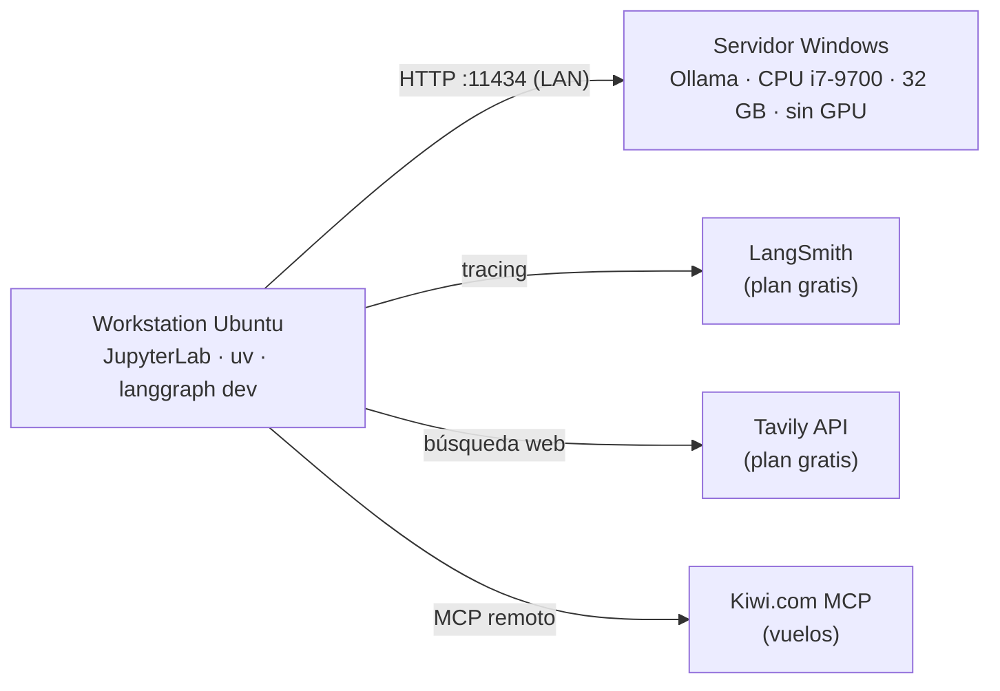
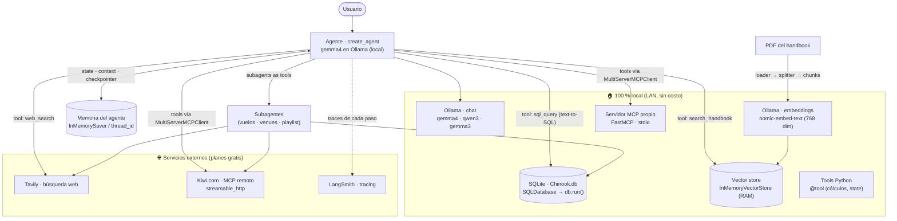
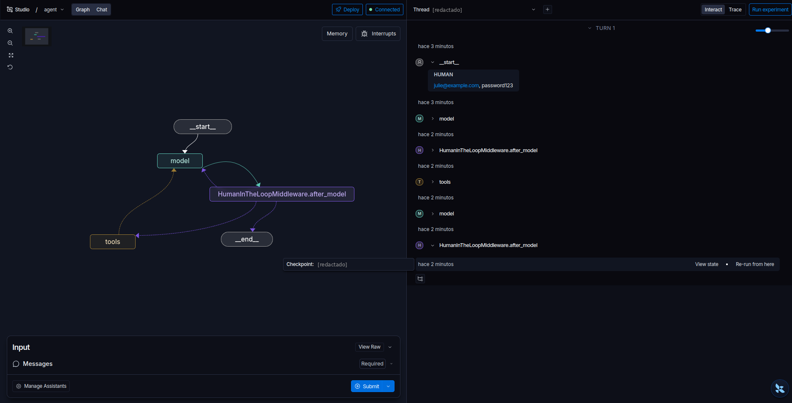
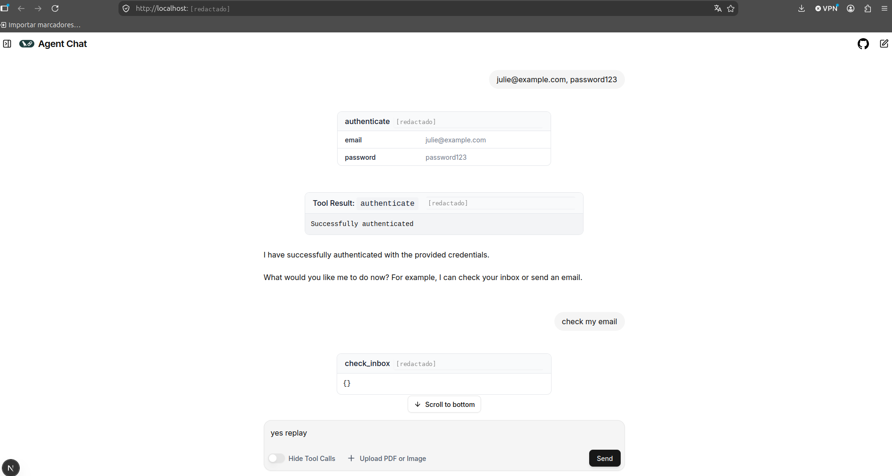

# LangChain Academy en local: el camino a la certificación LCAE con Ollama

> **EN:** Fork of LangChain Academy's *Introduction to LangChain (Python)* adapted to run **100 % locally on CPU with Ollama** (no paid LLM APIs). Each lesson is documented with what broke, why, and how it was fixed — practical evidence of my path to the **LangChain Certified Agent Engineer (LCAE)** certification.

Este repositorio es un fork del curso oficial [`langchain-ai/lca-lc-foundations`](https://github.com/langchain-ai/lca-lc-foundations) (licencia MIT). Lo adapté para correr **todos los notebooks con modelos locales en Ollama, sin GPU y sin APIs de pago**. Cada lección queda documentada como evidencia práctica: qué se rompió, por qué y cómo lo resolví.

**Autor:** Gino. Ingeniero de telecomunicaciones (optimización RAN/RF) en transición a ingeniería de IA y agentes.
<!-- LinkedIn: agrega aquí tu URL -->

---

## 🎯 Objetivo

Prepararme para la **LangChain Certified Agent Engineer (LCAE)**, cuyo examen evalúa 4 dominios (Build, Test, Deploy, Monitor), aprendiendo con restricciones reales:

- **Sin APIs de pago.** Los modelos corren en un servidor propio con Ollama.
- **Sin GPU.** Todo en CPU, así que la latencia y los tokens importan y se miden.
- **Documentación de cada problema** con el formato *problema → causa → solución → regla*.

Ver la [guía del examen](docs/examen-lcae.md) y la [hoja de repaso del stack y el flow](docs/repaso-stack-flow.md).

## 🖥️ Arquitectura del lab

### Infraestructura


### Cómo se conecta el agente con cada tipo de tool
Un mismo patrón (`create_agent` + tools) consume fuentes muy distintas. El modelo solo ve **nombre, docstring y argumentos** de cada tool; lo que hay detrás puede ser una API, un servidor MCP, una base SQL o un vector store.



| Tipo de tool | Dónde vive | Cómo se conecta | Lección | Lo que aprendí |
|---|---|---|---|---|
| **Modelo de chat** | Ollama local | `ChatOllama` vía [`local_model.py`](local_model.py) | [M1.1](docs/module-1/M1.1-foundational-models.md) | `reasoning=False` y `num_ctx` según el tamaño de las salidas de tools |
| **Tool Python** | Mismo proceso | `@tool` + `ToolRuntime` + `Command` | [M1.3](docs/module-1/M1.3-tools.md) · [M2.2](docs/module-2/M2.2b-state.md) | La docstring es la "interfaz" que lee el modelo |
| **API web** | Tavily (externa) | `@tool` que llama al SDK | [M1.4](docs/module-1/M1.4-web-search.md) | La salida de la tool es latencia: limitar `max_results` |
| **MCP local** | Subproceso propio | `MultiServerMCPClient` · `stdio` | [M2.1](docs/module-2/M2.1-mcp.md) | Tools MCP son async (`ainvoke`) |
| **MCP remoto** | Kiwi.com | `MultiServerMCPClient` · `streamable_http` + interceptor de reintentos | [M2.1b](docs/module-2/M2.1b-travel-agent.md) · [M2.4](docs/module-2/M2.4-wedding-planner.md) | Filtrar tools y subir `num_ctx`; errores como observación |
| **Base de datos SQL** | SQLite local | `SQLDatabase` + tool `sql_query` | [M2.B](docs/module-2/M2.B-bonus-rag-sql.md) · [M2.4](docs/module-2/M2.4-wedding-planner.md) | Dar el esquema real; el SQL puede correr y mentir → evaluar contra referencia |
| **RAG** | Embeddings en Ollama + vector store en RAM | loader → splitter → `OllamaEmbeddings` → `InMemoryVectorStore` → tool | [M2.B](docs/module-2/M2.B-bonus-rag-sql.md) | InMemory no persiste; mismo modelo de embeddings para indexar y consultar |
| **Subagentes** | Otros `create_agent` | *Subagents as tools* + state compartido | [M2.3](docs/module-2/M2.3-multi-agent.md) · [M2.4](docs/module-2/M2.4-wedding-planner.md) | Los datos obligatorios deben llegar al subagente por el state |
| **Observabilidad** | LangSmith | Variables `LANGSMITH_*` + `tags` | [Tracing](docs/langsmith-tracing-monitor.md) | El trace muestra el input real de cada tool (p. ej. el SQL) |

> **Portabilidad:** todas las integraciones cumplen las interfaces de `langchain-core` (chat model, embeddings, vector store, tool). Pasar de OpenAI a Ollama, o de `InMemoryVectorStore` a Chroma/pgvector, es cambiar el `import` y la construcción del objeto; el agente no cambia.

| Pieza | Uso |
|---|---|
| [`local_model.py`](local_model.py) | `get_model()` reemplaza a `init_chat_model("gpt-5-nano")` en todos los notebooks |
| Ollama | Chat: `gemma4:latest` (texto, tools, visión y audio), `qwen3:8b`, `qwen3:4b`, `gemma3:4b`. Embeddings: `nomic-embed-text` |
| LangSmith | Tracing de cada ejecución (dominio Monitor) |
| Tavily | Tool de búsqueda web |

Detalle completo en [docs/setup-lab-local.md](docs/setup-lab-local.md).

## 📈 Progreso

| Curso / Módulo | Lección | Estado | Notas |
|---|---|---|---|
| **01 · Introduction to LangChain** | M1.1 Foundational Models | ✅ | [nota](docs/module-1/M1.1-foundational-models.md) |
| | M1.2 Prompting | ✅ | [nota](docs/module-1/M1.2-prompting.md) |
| | M1.3 Tools | ✅ | [nota](docs/module-1/M1.3-tools.md) |
| | M1.4 Web Search | ✅ | [nota](docs/module-1/M1.4-web-search.md) |
| | M1.5 Memory | ✅ | [nota](docs/module-1/M1.5-memory.md) |
| | M1.6 Multimodal (imagen + audio) | ✅ | [nota](docs/module-1/M1.6-multimodal.md) |
| | M1.7 Personal Chef (proyecto + LangGraph Studio) | ✅ | [nota](docs/module-1/M1.7-personal-chef.md) |
| | M2.1 MCP (servidor propio + servidor de terceros) | ✅ | [nota](docs/module-2/M2.1-mcp.md) |
| | M2.1b Travel Agent (MCP remoto Kiwi.com) | ✅ | [nota](docs/module-2/M2.1b-travel-agent.md) |
| | M2.2a Runtime Context | ✅ | [nota](docs/module-2/M2.2a-runtime-context.md) |
| | M2.2b State | ✅ | [nota](docs/module-2/M2.2b-state.md) |
| | M2.3 Multi-Agent (subagents as tools) | ✅ | [nota](docs/module-2/M2.3-multi-agent.md) |
| | M2.4 Wedding Planner (proyecto: 3 subagentes + state + MCP + SQL) | ✅ (3 corridas) | [nota](docs/module-2/M2.4-wedding-planner.md) |
| | M2.B Bonus RAG (PDF → embeddings locales → agente) | ✅ | [nota](docs/module-2/M2.B-bonus-rag-sql.md) |
| | M2.B Bonus SQL (text-to-SQL sobre Chinook) | ✅ (3 intentos: v3 correcto y evaluado) | [nota](docs/module-2/M2.B-bonus-rag-sql.md) |
| | M3.0 Módulo 3 adaptado a local (middleware) | ✅ adaptado | [nota](docs/module-3/M3.0-adaptacion-local.md) |
| | M3.2 Managing Messages (summarization, trim, checkpointer) | ✅ | [nota](docs/module-3/M3.2-managing-messages.md) |
| | M3.3 Human-in-the-Loop (approve / edit / reject) | ✅ | [nota](docs/module-3/M3.3-hitl.md) |
| | M3.4 Dynamic models / prompts / tools | ✅ models · prompts · tools (+ hallazgo de seguridad) | [nota](docs/module-3/M3.4-dynamic.md) |
| | M3.5 Email Agent (proyecto: auth + dynamic tools/prompt + HITL, servido en Studio) | ✅ | [nota](docs/module-3/M3.5-email-agent.md) |
| | 🏁 **Curso 01 completado** (módulos 1–3 + bonus, 100 % local) | ✅ | [repaso](docs/repaso-stack-flow.md) |
| **02 · Introduction to Deep Agents** | 2/25 lecciones (Python + TypeScript en los labs ⭐) | 🟨 | [checklist](#-curso-02--deep-agents-en-curso) · [carpeta](curso-02-deep-agents/) |
| 03 · Building Reliable Agents (Test) | | ⬜ | |
| 04 · Monitoring Production Agents | | ⬜ | |
| 05 · LangSmith Deployment | | ⬜ | |
| 06 · LCAE Practice Exam → **Examen** | | ⬜ | |

### 🗺️ Curso 02 · Deep Agents (en curso)
Código adaptado y notas en [`curso-02-deep-agents/`](curso-02-deep-agents/) (Python y TypeScript con Ollama local).

**Módulo 0 · Setup**

- [x] **M0.1** Setup (Ollama local) — 🐍 ✅ · [nota](curso-02-deep-agents/docs/M0.1-setup-local.md)

**Módulo 1 · Fundamentos del deep agent**

- [ ] **M1.1** Overview — 🐍 ⬜
- [x] **M1.2** ⭐ Running a deep agent — 🐍 ✅ · 🟦 TS ✅ · [nota](curso-02-deep-agents/docs/M1.2-running-a-deep-agent.md)
- [ ] **M1.3** Models — 🐍 ⬜
- [ ] **M1.4** System prompt — 🐍 ⬜
- [ ] **M1.5** ⭐ Tools — 🐍 ⬜ · 🟦 TS ⬜
- [ ] **M1.6** MCP — 🐍 ⬜
- [ ] **M1.7** ⭐ Messages, threads y checkpointers — 🐍 ⬜ · 🟦 TS ⬜
- [ ] **M1.8** ⭐ Human-in-the-loop — 🐍 ⬜ · 🟦 TS ⬜
- [ ] **M1.9** Práctica — 🐍 ⬜

**Módulo 2 · Entorno: filesystem, sandboxes, interpreter**

- [ ] **M2.1** El entorno del deep agent — 🐍 ⬜
- [ ] **M2.2** Filesystem backends — 🐍 ⬜
- [ ] **M2.3** Sandboxes y LocalShell — 🐍 ⬜
- [ ] **M2.4** Interpreter — 🐍 ⬜

**Módulo 3 · Contexto: summarization, skills, memoria**

- [ ] **M3.1** Summarization y context offloading — 🐍 ⬜
- [ ] **M3.2** Skills — 🐍 ⬜
- [ ] **M3.3** Memory — 🐍 ⬜

**Módulo 4 · Subagentes**

- [ ] **M4.1** ⭐ Delegation — 🐍 ⬜ · 🟦 TS ⬜
- [ ] **M4.2** Equipo de subagentes — 🐍 ⬜
- [ ] **M4.3** Subagentes dinámicos — 🐍 ⬜

**Módulo 5 · Proyecto y despliegue**

- [ ] **M5.1** Putting it all together — 🐍 ⬜
- [ ] **M5.2** Despliegue local — 🐍 ⬜
- [ ] **M5.3** ⭐ Sales assistant (capstone) — 🐍 ⬜ · 🟦 TS ⬜
- [ ] **M5.4** Subagentes asíncronos — 🐍 ⬜
- [ ] **M5.5** Agente asíncrono con sandbox — 🐍 ⬜

El registro cronológico está en la [bitácora](docs/bitacora.md).

## 🔬 Hallazgos medidos en el lab (CPU, sin GPU)

| Hallazgo | Dato real | Lección |
|---|---|---|
| El *thinking* de qwen3 en CPU es carísimo | ~5,7 tokens/s → hay que usar `reasoning=False` | [M1.1](docs/module-1/M1.1-foundational-models.md) |
| La salida de las tools es latencia | 5 resultados de Tavily ≈ 2.000 tokens ≈ 60 s solo leyendo | [M1.4](docs/module-1/M1.4-web-search.md) |
| Sin tool, el modelo inventa con seguridad | Dijo un presidente de Colombia equivocado; con búsqueda acertó | [M1.4](docs/module-1/M1.4-web-search.md) |
| La memoria reenvía el historial | Tokens de entrada 22 → 91 en el segundo turno | [M1.5](docs/module-1/M1.5-memory.md) |
| Capacidad del modelo ≠ soporte de la integración | gemma4 oye audio, pero `langchain-ollama` rechaza bloques `audio`. Lo resolví con audio a 16 kHz | [M1.6](docs/module-1/M1.6-multimodal.md) |
| Un modelo multimodal alucina con entrada vacía | Con el micrófono mudo "transcribió" frases que nadie dijo | [M1.6](docs/module-1/M1.6-multimodal.md) |
| gemma4 es el más rápido del lab para agentes | ~10,8 tok/s generando frente a ~5,7 de qwen3:8b | [M1.7](docs/module-1/M1.7-personal-chef.md) |
| El prompt es la palanca más barata de latencia | Limitar la salida y `max_results=3`: 107,9 s → 31,8 s y 863 → 220 tokens, y además cita fuentes | [M1.7](docs/module-1/M1.7-personal-chef.md) |
| Contexto desbordado: el modelo "olvida" la pregunta | Kiwi + historial > 8.192 tokens → el modelo preguntó "¿ciudad de origen?"; con 32K respondió bien (9.866 tokens en un paso) | [M2.1b](docs/module-2/M2.1b-travel-agent.md) |
| La tool funciona pero el usuario no recibe respuesta | gemma4 actualizó y leyó el state bien, pero su último mensaje llegó vacío (1 token) | [M2.2b](docs/module-2/M2.2b-state.md) |
| Status *success* ≠ resultado correcto | El Wedding Planner terminó sin errores, pero el subagente de vuelos pidió la fecha en vez de buscar (Kiwi la exige) | [M2.4](docs/module-2/M2.4-wedding-planner.md) |
| Arreglar un prompt puede romper otra salida | Con la fecha en el state hubo vuelos reales desde Bogotá y costo correcto ($14,85), pero la duración salió en 0 min → hace falta probar regresiones | [M2.4](docs/module-2/M2.4-wedding-planner.md) |
| El SQL del LLM corre sin error y da un dato falso | `STRFTIME('%M:%S', ms/1000)` sin `'unixepoch'` → todas las duraciones en `00:00`; referencia real 52,8 min. Hay que validar el SQL o fijarlo en el prompt o en la tool | [M2.4](docs/module-2/M2.4-wedding-planner.md) |
| RAG 100 % local en CPU | Embeddings `nomic-embed-text` (768 dim) + gemma4: respuesta correcta en ~10,5 s. El vector store en memoria se pierde al reiniciar el kernel | [M2.B](docs/module-2/M2.B-bonus-rag-sql.md) |
| Sin esquema, el LLM inventa la BD | gemma4 consultó `artists.popularity` (no existe) y luego preguntó al usuario en vez de explorar `sqlite_master` | [M2.B](docs/module-2/M2.B-bonus-rag-sql.md) |
| SQL válido, respuesta falsa | Con el esquema, gemma4 respondió *System Of A Down* con seguridad; su JOIN usaba una columna inexistente que SQLite resolvió en silencio (todos empatados en 2240). Referencia: Smashing Pumpkins | [M2.B](docs/module-2/M2.B-bonus-rag-sql.md) |
| El esquema en el prompt corrige el text-to-SQL | `db.get_table_info()` + camino de JOIN → *Smashing Pumpkins* ✅ en una query; un evaluador contra la referencia marcó v2 ❌ y v3 ✅ | [M2.B](docs/module-2/M2.B-bonus-rag-sql.md) |
| Recortar el historial puede borrar la evidencia | `SummarizationMiddleware` pasó 9 mensajes a 3 sin perder hechos; el trim de `ToolMessage`s borró `temp=42C` y el agente no pudo responder la temperatura | [M3.2](docs/module-3/M3.2-managing-messages.md) |
| HITL solo protege lo que el modelo pide | Sin system prompt, gemma4 no llamó ninguna tool (la docstring pedía una "address" inexistente) → nunca hubo pausa. Con prompt explícito: pausa, approve, edit y reject OK | [M3.3](docs/module-3/M3.3-hitl.md) |
| Las decisiones HITL son datos de entrenamiento | Con un prompt de reintento, gemma4 volvió a pedir `send_email` tras el Reject (pero con el mismo texto). `decidir()` guardó approve/edit/reject como 3 ejemplos JSONL para SFT/DPO | [M3.3](docs/module-3/M3.3-hitl.md) |
| El ruteo de modelos no se ve como un paso | `wrap_model_call` mandó 1 mensaje a gemma4 y 11 a qwen3:8b (32K); la elección solo aparece en `model_name` / `ls_model_name` del trace → loguear el motivo | [M3.4](docs/module-3/M3.4-dynamic.md) |
| 🚨 Ocultar una tool no es bloquearla | Con `override(tools=[web_search])`, el rol `external` igual ejecutó `sql_query` (el modelo la nombró porque aparecía en el prompt). Corregido con un guardia `@wrap_tool_call` (lista blanca por rol): bloqueó a `external` incluso cuando el usuario pidió la tool por nombre y cuando gemma4 inventó `database_query` | [M3.4](docs/module-3/M3.4-dynamic.md) |
| En Studio, el middleware `wrap_model_call` no es un nodo | El grafo del Email Agent muestra `model` y `HumanInTheLoopMiddleware.after_model`; dynamic tools/prompt corren **dentro** de `model` | [M3.5](docs/module-3/M3.5-email-agent.md) |
| La UI del curso no compilaba | Faltaba `agent-chat-ui/src/lib/`: el `.gitignore` de Python (`lib/`) la excluía del repo del curso. Reconstruida desde el repo oficial (commit `d93ba24`) + `app-config.ts` propio de la Academy | [M3.5](docs/module-3/M3.5-email-agent.md) |

**Evidencia: el Email Agent del módulo 3 (auth + dynamic tools + HITL) en LangGraph Studio con gemma4 local**



**…y en Agent Chat UI (Next.js) conectada al mismo servidor local**



**Evidencia: el agente del módulo 1 corriendo en LangGraph Studio con gemma4 local**


Agent Chat UI, cómo conecta y cómo llevarla a producción: [docs/agent-chat-ui-produccion.md](docs/agent-chat-ui-produccion.md) · Servidores MCP usados y lo que exponen: [docs/mcp-catalog.md](docs/mcp-catalog.md) · Todas las reglas consolidadas: [docs/lecciones-aprendidas.md](docs/lecciones-aprendidas.md) · Observabilidad: [docs/langsmith-tracing-monitor.md](docs/langsmith-tracing-monitor.md)

## 🔧 Qué cambia respecto al curso original

| Original | En este fork |
|---|---|
| `init_chat_model("gpt-5-nano")` / `create_agent("gpt-5-nano")` | `create_agent(model=get_model())` → Ollama |
| Claude / Gemini en M1.1 | `qwen3:4b`, `gemma3:4b` |
| `OpenAIEmbeddings` (bonus RAG) | `OllamaEmbeddings("nomic-embed-text")` |
| `gpt-audio` (M1.6) | `gemma4:latest` + audio 16 kHz mono |
| Keys de OpenAI, Anthropic y Google | No se necesitan |
| `MultiServerMCPClient` sin filtro (M2.1b, M2.4) | Solo la tool `search-flight` de Kiwi y `num_ctx=32768` |
| `InMemorySaver` en el grafo de `langgraph dev` | Eliminado: el servidor maneja la persistencia |

Las celdas originales quedan comentadas junto a las adaptadas: **🔸 ORIGINAL DEL CURSO** (con el motivo) → **🟢 ADAPTADO LOCAL** (la que corre). Ver la convención en [docs/setup-lab-local.md](docs/setup-lab-local.md).

## 🎒 Ruta guiada para aprender (nuevo)

¿Sabes algo de Python y quieres aprender agentes desde cero con este repo? Hay una ruta pensada para estudiantes:

- **[Módulo 1 guiado](notebooks/module-1-guiado/README.md)**: 7 notebooks limpios, con explicaciones sencillas en español, analogías, mnemotecnias, ejercicios "✍️ Tu turno" y mini quizzes.
- **Tutor en OpenCode** ([`.agents/skills/tutor-lca-intro`](.agents/skills/tutor-lca-intro/SKILL.md)): explica, pregunta y da pistas sin resolver los ejercicios. También funciona con Claude Code y otros agentes que lean `.agents/skills`.
- **[Guía de instalación en Windows](docs/guia-estudiante-windows.md)**: de cero a correr el primer notebook, con un servidor Ollama compartido (semáforo 🟢🟡🔴 para turnarse).

## 🚀 Cómo correrlo

**Requisitos:** Python 3.12+, [uv](https://docs.astral.sh/uv/) y [Ollama](https://ollama.com) (en la misma máquina o en otra de la red).

```bash
git clone https://github.com/codeviloria/camino-lcae-langchain-local.git
cd camino-lcae-langchain-local
cp .env.example .env
uv sync
```

Edita el `.env` con `OLLAMA_BASE_URL`, `TAVILY_API_KEY` y, de forma opcional, `LANGSMITH_API_KEY`.

En el servidor de Ollama:

```bash
ollama pull gemma4
ollama pull qwen3:8b
ollama pull nomic-embed-text
```

Si Ollama corre en otra máquina, arráncalo con `OLLAMA_HOST=0.0.0.0` y abre el puerto 11434 en el firewall.

Para los notebooks:

```bash
uv run jupyter lab
```

Para el agente del módulo 1 en LangGraph Studio:

```bash
cd notebooks/module-1
uv run langgraph dev
```

Luego abre `https://smith.langchain.com/studio/?baseUrl=http://127.0.0.1:2024`.

## 🔒 Privacidad del repo

Antes de publicar, las salidas de los notebooks se sanitizaron:
- Las celdas de verificación de keys ya no imprimen fragmentos de la key y se borraron sus salidas.
- Se quitaron los IDs de tenant de LangSmith, la IP del servidor y las rutas locales.
- Se reemplazaron las grabaciones de voz por un aviso.
- Se quitaron nombres personales de prompts y nombres de tools, y se taparon IDs en las capturas de LangSmith.

El `.env` nunca se versiona (está en `.gitignore`); usa [`.env.example`](.env.example) como plantilla.

## 📚 Créditos

- Curso y notebooks originales: [LangChain Academy](https://academy.langchain.com/courses/foundation-introduction-to-langchain-python) · [`langchain-ai/lca-lc-foundations`](https://github.com/langchain-ai/lca-lc-foundations), licencia [MIT](LICENSE).
- README original del curso: [docs/COURSE_README.md](docs/COURSE_README.md).
