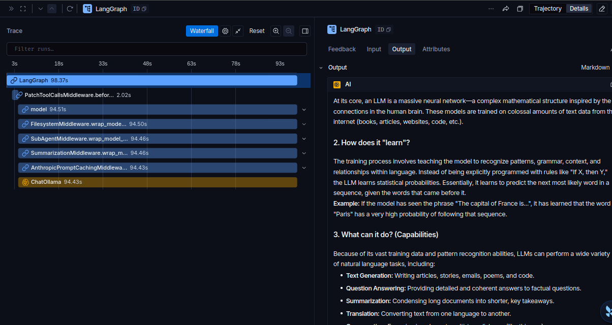
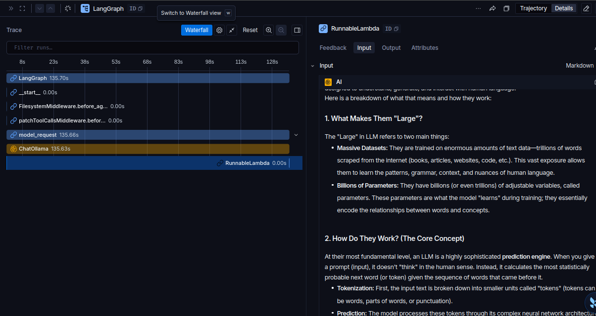

# M1.2 · Running a deep agent

> **Estado:** ✅ · **Fecha:** 2026-10-06 · **Lab Python:** `python/m1/m1.2_scratch_agent.py` · **Lab TS ⭐:** `typescript/m1/m1.2_scratch_agent.ts`

## 🧸 La idea en simple
`create_agent` (curso 01) es un chef con un cuchillo: tú le das todo. `create_deep_agent` es el mismo chef con una **cocina completa** ya montada: libreta de tareas, despensa y ayudantes. Para una pregunta simple casi no usa la cocina, pero ya la tiene lista para tareas largas.

## 📚 Conceptos clave
- **`create_deep_agent(model=...)`** = `create_agent` + un kit incluido:
  - `write_todos`: planificar, con una lista de tareas que el agente va tachando.
  - `ls`, `read_file`, `write_file`, `edit_file`, `glob`, `grep`: filesystem **virtual**, que vive en el state y no en tu disco.
  - `task`: delegar en subagentes (módulo 4).
  - Un **system prompt largo** que le explica cómo usar todo lo anterior.
  - Middleware de resumen para conversaciones largas (módulo 3).
- El **modelo decide** si usa el kit. Tenerlo no obliga a usarlo.
- `result["messages"][-1].text` (Python) y `result.messages.at(-1)?.text` (TS) devuelven el texto final.

## 🧪 Resultado del lab
Pregunta: *"What is an LLM?"*, con el modelo `gemma4:latest` en Ollama (CPU).

| Lenguaje | Tiempo | Mensajes | Tools usadas |
|---|---|---|---|
| TypeScript (corrido primero) | 135.8 s | `human → ai` | ninguna |
| Python (corrido después) | 98.5 s | `HumanMessage → AIMessage` | ninguna |

Las dos respuestas son equivalentes: definición, entrenamiento, transformer, capacidades y limitaciones.

## 🔀 Python vs TypeScript
| Python | TypeScript |
|---|---|
| `from deepagents import create_deep_agent` | `import { createDeepAgent } from "deepagents"` |
| `create_deep_agent(model=model)` | `createDeepAgent({ model })` |
| `agent.invoke({...})` | `await agent.invoke({...})` |
| `result["messages"][-1].text` | `result.messages.at(-1)?.text` |
| `from models import model` | `import { model } from "../models.js"` |
| `type(m).__name__` → `HumanMessage` | `m.getType()` → `human` |

## 🔭 La traza en LangSmith: mismo agente, dos "radiografías"

| Python (98.4 s) | TypeScript (135.7 s) |
|---|---|
|  |  |

**Lo que se ve:** un deep agent es `create_agent` + una **pila de middleware**. La pila es la misma en los dos lenguajes; lo que cambia es **cómo cada SDK la dibuja**.

| | Python | TypeScript |
|---|---|---|
| Nodo del modelo | `model` | `model_request` |
| Hooks `before_agent` (node-style) | `PatchToolCallsMiddleware.before_agent` (2.02 s) | `FilesystemMiddleware.before_agent`, `patchToolCallsMiddleware.before_agent` (0.00 s) |
| Hooks `wrap_model_call` (wrap-style) | **Sí aparecen**, anidados como capas de cebolla: Filesystem → SubAgent → Summarization → AnthropicPromptCaching → ChatOllama | **No aparecen** como spans: corren dentro de `model_request` sin dibujarse |
| Llamada real al modelo | `ChatOllama` 94.43 s | `ChatOllama` 135.63 s |

**Conclusiones:**
- La traza de Python **parece** más larga, pero no hace más trabajo: de `model` (94.51 s) a `ChatOllama` (94.43 s) el middleware completo suma solo **0.08 s**. Más del 95 % del tiempo es el modelo en CPU.
- Es el mismo patrón del curso 01 (M3.5): en Python cada `wrap_model_call` es un span, y **el primero de la lista envuelve al siguiente**.
- `AnthropicPromptCachingMiddleware` aparece aunque el modelo sea Ollama: Deep Agents lo agrega por defecto. Con un modelo que no es Anthropic no aporta nada, pero tampoco estorba (0.03 s).
- Los 2.02 s de `PatchToolCallsMiddleware.before_agent` en Python son probablemente costo de la primera llamada. Hay que confirmarlo corriendo el lab otra vez.
- El modelo explica la diferencia de tiempo entre lenguajes (135.6 s vs 94.4 s en `ChatOllama`), no el middleware: es el **arranque en frío**.

**🎯 Para el examen:** la pila por defecto de un deep agent incluye middleware de **filesystem, subagentes, summarization, prompt caching (Anthropic) y patch de tool calls**, más el de todos que aporta `write_todos`.

**🧠 Mnemotecnia:** **"Un deep agent es una cebolla: el modelo está en el centro y cada middleware es una capa."** En la traza de Python ves las capas; en la de TS solo ves la cebolla entera.

## ☁️ Extra: el mismo lab en la nube (OpenRouter), adelanto de M1.3
Con `MODEL_PROVIDER=openrouter` en el `.env` (modelo `nvidia/nemotron-3-ultra-550b-a55b:free`), **sin tocar una línea del lab**:

| Corrida | Proveedor | Python | TypeScript |
|---|---|---|---|
| 1 | Ollama local, CPU (gemma4) | 98.5 s | 135.8 s (frío) |
| 2 | OpenRouter, nube (Nemotron :free) | **23.2 s** | **13.9 s** |

**Lo que se aprende:**
- **El agente no cambió, solo el motor.** `create_deep_agent(model=model)` es igual; `models.py`/`models.ts` decide quién es `model`. Esto es lo que enseña M1.3.
- La nube fue **4 a 10 veces más rápida** que la CPU local, y de las dos respuestas, la de Python fue la más larga (tabla y más secciones). Con un modelo en la nube el tiempo depende sobre todo de **cuántos tokens genera** y de la red, no del lenguaje.
- OpenRouter se conecta con `ChatOpenAI` aunque el modelo sea de NVIDIA: su API es **compatible con OpenAI**, y solo cambia `base_url`.
- En LangSmith, las trazas de Python y TS siguen viéndose distintas: Python dibuja cada capa de middleware y TS no. Eso depende del SDK, no del proveedor.
- ⚖️ **Trade-off:** local = gratis, privado, sin límites y lento. Nube `:free` = rápido, pero con límites de uso y el proveedor puede registrar los prompts. No mandes datos sensibles.

### 📚 Por qué los parámetros de Ollama (la línea del curso no basta en este lab)
| La línea del curso `init_chat_model("ollama:qwen2.5:7b")` asume… | En este lab… | Parámetro |
|---|---|---|
| Ollama en **localhost** | Ollama corre en **otro servidor** de la LAN | `base_url` / `baseUrl` |
| Contexto por defecto de Ollama (pocos miles de tokens) | El system prompt del deep agent ocupa varios miles: Ollama lo **recorta en silencio** y el agente "olvida" sus tools | `num_ctx` / `numCtx` = 16k (32k el fuerte) |
| Modelo sin "pensamiento" | qwen3/gemma4 piensan por defecto: en CPU son minutos extra | `reasoning=False` / `think: false` |

Ahora `models.py`/`models.ts` usan `init_chat_model("ollama:gemma4:latest", base_url=..., num_ctx=..., reasoning=False)`, el mismo estilo del curso y del examen, y ya no hay helper `local_model`.

## 🛠️ Problema → causa → solución → regla
| # | Problema | Causa | Solución | Regla |
|---|---|---|---|---|
| 1 | TS tardó 37 s más que Python | **Arranque en frío**: TS corrió primero y Ollama tuvo que cargar gemma4 en RAM; Python lo encontró ya cargado | Comparar tiempos con el modelo ya cargado, o correr cada lab dos veces | Una diferencia de tiempo **no** es "TS es más lento": primero descarta el arranque en frío |
| 2 | Una pregunta trivial tarda 1.5–2 min | El system prompt del deep agent es largo y la CPU lo procesa entero antes de responder | Aceptarlo en CPU; para pruebas rápidas usar preguntas cortas | En deep agents el costo fijo es el system prompt: más tokens de entrada = más latencia |
| 4 | En TS, `export const model` duplicado al descomentar OpenRouter | En TS no se puede declarar dos veces la misma constante (en Python la última línea "gana" en silencio) | Interruptor `MODEL_PROVIDER` en el `.env` + ternario | Cambiar de proveedor por configuración, no editando código |
| 3 | `tool_calls` no compilaba en TS (`never`) | El tipo se infiere de las tools declaradas, y aquí no hay | Type guard `AIMessage.isInstance(m)` + `as { name: string }[]` | En TS hay que **convencer al compilador** de lo que en Python solo se asume |

## 🎯 Para el examen
- ¿Qué trae `create_deep_agent` que `create_agent` no trae? Planning (`write_todos`), filesystem virtual, subagentes (`task`), un system prompt detallado y summarization.
- Si un deep agent responde una pregunta simple **sin** usar tools, está funcionando bien: el modelo decide.
- El filesystem de un deep agent por defecto es **virtual (state)**, no el disco. Los backends reales se ven en M2.2.

## 🧠 Mnemotecnia
- **P-A-D:** Planear (todos) · Archivar (filesystem) · Delegar (task).
- **O-A-J** (TS): todo va en un **O**bjeto, todo se **A**wait-ea y los imports llevan **.J**s.

## 💼 Para el CV
Primer deep agent en **Python y TypeScript** con proveedor intercambiable por configuración (Ollama local en CPU ↔ OpenRouter en la nube), con medición de latencia: ~100 s local vs ~14–23 s en la nube.
