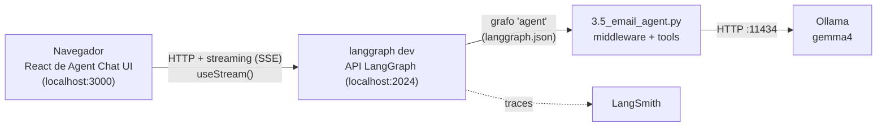
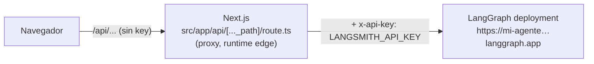

# Agent Chat UI: cómo se conecta y cómo llevarla a producción

La UI (Next.js) **no tiene lógica del agente**: es una ventana de chat que habla con la **API HTTP del servidor LangGraph**. El agente vive en el servidor (`langgraph dev` en local, un deployment en producción).

## 1. Cómo se conecta en desarrollo (mi lab)

- El componente `Stream.tsx` usa **`useStream`** de `@langchain/langgraph-sdk/react` con dos datos: **`apiUrl`** (`http://localhost:2024`) y **`assistantId`** (`agent` = el nombre del grafo en `langgraph.json`).
- Lo que hace por debajo contra la API del servidor:

| Acción en la UI | Llamada a la API LangGraph |
|---|---|
| Al abrir: "¿el servidor está vivo?" | `GET /info` |
| Nueva conversación | `POST /threads` → un `thread_id` (aparece en la URL: `?threadId=…`) |
| Enviar un mensaje | `POST /threads/{id}/runs/stream` → respuesta **en streaming** (SSE): mensajes, tool calls, interrupts |
| Historial | `POST /threads/search`, `GET /threads/{id}/state` |
| Botones de HITL (aprobar, editar, rechazar) | Nuevo run con `Command(resume=...)` en el **mismo thread** |

- En local el navegador se conecta **directo** al servidor (sin API key): `langgraph dev` acepta peticiones desde `localhost:3000`.
- El checkpointer lo pone el **servidor** (por eso el `.py` no lleva `InMemorySaver`): cada `threadId` de la URL es un `thread_id`.

## 1b. ¿Qué `.env` toma cada pieza y se traza en LangSmith?
| Pieza | Lee | Variables que importan |
|---|---|---|
| **Agent Chat UI** (`pnpm dev`) | `agent-chat-ui/.env` | Solo `NEXT_PUBLIC_API_URL` y `NEXT_PUBLIC_ASSISTANT_ID` (a dónde conectarse). **No traza nada**: no conoce LangSmith ni Ollama |
| **`uv run langgraph dev`** | El `.env` de la **raíz** del repo, porque `langgraph.json` dice `"env": "../../.env"` | `OLLAMA_HOST`, `TAVILY_API_KEY`, `LANGSMITH_API_KEY`, `LANGSMITH_TRACING=true`, `LANGSMITH_PROJECT` |

**Conclusión:** el tracing lo hace el **servidor**, no la UI. Todo lo que escribes en la UI se ejecuta en `langgraph dev`, y si `LANGSMITH_TRACING=true` en el `.env` de la raíz, cada run queda en LangSmith en el proyecto de `LANGSMITH_PROJECT` (`lca-lc-foundations`). Es lo mismo que pasa al usar Studio.

**Cómo comprobarlo:**
1. En la terminal de `uv run langgraph dev`, cada mensaje enviado desde la UI aparece como una petición a `/threads/…/runs/stream`. Esa es la prueba de que la UI habla con ese servidor.
2. En LangSmith → proyecto `lca-lc-foundations` → el run más reciente. En su metadata aparecen los campos del servidor (`LANGGRAPH_API_URL`, `thread_id`, `assistant_id`, `langgraph_node`…).
3. El `thread_id` del run es el mismo `threadId` que muestra la URL de la UI (`localhost:3000/?threadId=…`): así se cruza una conversación de la UI con su trace.

> Si no aparece en LangSmith: revisar `LANGSMITH_TRACING=true` y la key en el `.env` de la **raíz**, y reiniciar `langgraph dev` (lee el `.env` al arrancar).

## 2. Producción: 3 caminos
| | A. Deployment administrado + proxy | B. Self-hosted (Docker) | C. Solo red interna (mi lab) |
|---|---|---|---|
| Agente | **LangSmith Deployment** (curso 05) | `langgraph build -t mi-agente` → imagen Docker + **Postgres** (threads/checkpoints) + **Redis** (colas y streaming) | `langgraph dev` o el contenedor en un server de la LAN |
| UI | Vercel u otro hosting Next.js | `pnpm build` + `pnpm start` (o contenedor) detrás de Nginx/Caddy con HTTPS | `pnpm dev` / `pnpm start` en la LAN |
| Autenticación | **API Passthrough**: la UI llama a su propio `/api`, y el servidor de Next.js agrega la `LANGSMITH_API_KEY` | **Custom auth** en el servidor LangGraph + token en los headers de `useStream` | Ninguna: solo red interna o VPN |
| Cuándo | Lo más rápido para publicar | Control total, datos en casa | Demos y lab |

### A. API Passthrough (ya viene en la UI)

Variables del **hosting de la UI**:
| Variable | Valor | ¿Secreta? |
|---|---|---|
| `NEXT_PUBLIC_ASSISTANT_ID` | `agent` | No (va al navegador) |
| `NEXT_PUBLIC_API_URL` | `https://mi-sitio.com/api` (el **proxy**, no el deployment) | No |
| `LANGGRAPH_API_URL` | URL del deployment | Solo servidor |
| `LANGSMITH_API_KEY` | `lsv2_…` | **Sí**: sin prefijo `NEXT_PUBLIC_`, nunca llega al navegador |

> Regla: todo lo que empieza por `NEXT_PUBLIC_` se **publica** en el JavaScript del navegador. Nunca secretos ahí.

### B. Self-hosted: piezas mínimas
1. `langgraph build -t email-agent` (usa el mismo `langgraph.json`) → imagen Docker del servidor.
2. Postgres + Redis (para probar en local: `langgraph up` levanta todo con Docker Compose).
3. UI: `pnpm build` + `pnpm start`, o una imagen propia.
4. Proxy inverso con HTTPS delante de ambos. Autenticación: custom auth de LangGraph (`@auth.authenticate`) o el passthrough con una key propia.
5. Revisar en la documentación de LangChain las condiciones de licencia del servidor self-hosted antes de usarlo en producción.

### C. Mi caso (Ollama en la LAN)
- **No exponer a internet** ni Ollama (`:11434`, no tiene autenticación) ni el servidor del agente (`:2024`).
- Para usarlo desde fuera: **VPN** (o Tailscale/WireGuard), no abrir puertos.
- En producción con datos reales: checkpointer persistente (Postgres), traces en LangSmith y el guardia de permisos (`@wrap_tool_call`, M3.4).

## 3. ⚠️ Seguridad de la versión del curso
La UI del curso corresponde al commit `d93ba24` (nov-2025) del repo oficial. Después, el repo oficial corrigió una fuga: un enlace con el parámetro `?apiUrl=` podía mandar la API key guardada en el navegador a otro servidor (commit *"stop apiUrl query param leaking LangSmith key"*). En local sin key no aplica; **para producción usar la versión actual del repo oficial**.

## 4. Usarla como plantilla (checklist)
| Qué cambiar | Dónde |
|---|---|
| Nombre y descripción de la app | `src/lib/app-config.ts` (`APP_CONFIG`) |
| Logo | `public/logo.png` |
| Grafo a usar | `NEXT_PUBLIC_ASSISTANT_ID` = nombre en `langgraph.json` |
| Requisito del agente | El state debe tener la llave **`messages`** |
| Interfaz de HITL | Ya viene: `components/thread/agent-inbox` muestra los interrupts de `HumanInTheLoopMiddleware` |
| Ocultar mensajes internos | Tag `langsmith:nostream` (no mostrar en streaming) o `id` con `do-not-render-` (nunca mostrar) |
| Panel lateral con resultados | **Artifacts** (`thread.meta.artifact`) |
| Archivos | Ya permite subir PDF o imagen (bloques multimodales) |
| Historial de conversaciones | Panel lateral de threads |

Idea para mis proyectos: el mismo patrón sirve para un copiloto de RF/RAN: agente LangGraph en un server de la LAN, esta UI como frente y HITL para aprobar cambios de parámetros.

## 🎯 Para el examen (dominio Deploy)
- La UI se conecta a la **API de LangGraph Server** con `useStream` (`apiUrl` + `assistantId`); el `assistantId` es el nombre del grafo en `langgraph.json`.
- `thread_id` = conversación persistida por el **servidor** (no hace falta checkpointer en el código).
- Producción: **API Passthrough** (key inyectada en el servidor del proxy) o **custom auth** (token del usuario en headers).
- `NEXT_PUBLIC_*` = público; secretos sin ese prefijo.
- Self-hosted: `langgraph build` / `langgraph up` + Postgres + Redis.

## Enlaces
- [M3.5 Email Agent](module-3/M3.5-email-agent.md) · [Guía del examen](examen-lcae.md)
