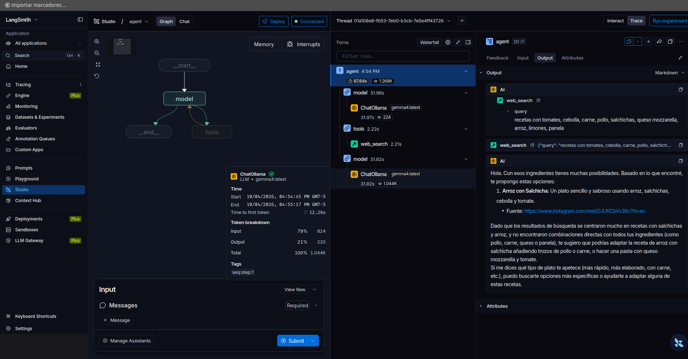

# M1.7 Personal Chef (proyecto del módulo 1)

## Resumen
Mini proyecto que **junta todo el módulo 1** en un solo agente:

| Pieza | Lección | En este agente |
|---|---|---|
| System prompt | [M1.2 Prompting](M1.2-prompting.md) | Rol de chef personal (lo traduje al español) |
| Tool | [M1.3 Tools](M1.3-tools.md) · [M1.4 Web Search](M1.4-web-search.md) | `web_search` con Tavily |
| Memoria | [M1.5 Memory](M1.5-memory.md) | `InMemorySaver` + `thread_id="1"` |
| Modelo local | [M1.6 Multimodal](M1.6-multimodal.md) | `gemma4:latest` (soporta tools) |

## Código
```python
system_prompt = """
Tú eres un chef personal. El usuario te dará una lista de ingredientes que tiene disponibles en su casa.
Usando la tool web_search, busca en la web recetas que se puedan preparar con esos ingredientes.
Entrega la receta y sugerencias, y las instrucciones de la receta si el usuario las pide.
"""

agent = create_agent(
    model=get_model("gemma4:latest"),
    tools=[web_search],
    system_prompt=system_prompt,
    checkpointer=InMemorySaver(),
)

config = {"configurable": {"thread_id": "1"}}
agent.invoke({"messages": [HumanMessage("tengo pollo, uvas verdes, berenjena, papa, cebolla, zanahoria")]}, config)
```

## Qué pasó
1. **El modelo decidió buscar solo** y armó la consulta en español: `web_search("recetas con pollo uvas verdes berenjena papa cebolla zanahoria")`.
2. Tavily devolvió 5 resultados (YouTube, Instagram, Cookpad) con transcripciones largas.
3. El modelo propuso **"Pollo al horno mediterráneo con uvas"**, con pasos, ingredientes extra (aceite, sal, ajo, limón) y una alternativa en guiso.
4. Terminó preguntando si quiero más detalle → el `thread_id` permite seguir la conversación.

## Medición (gemma4, CPU)
| Paso | Entrada | Generados | Tiempo |
|---|---|---|---|
| Modelo → decide buscar | 153 tokens | 30 | 4,8 s |
| Tavily | — | — | ~2 s |
| Modelo → receta | **1.641** | **863** | **107,9 s** (27,8 s leyendo + 80 s escribiendo) |

> gemma4 en este server: **~59 tok/s leyendo y ~10,8 tok/s generando**, casi el doble que qwen3:8b (~33 y ~5,7). Para agentes con tools en este lab, **gemma4 es más rápido**.

## 🧠 Lecciones aprendidas
| # | Problema / observación | Causa | Solución | Regla |
|---|---|---|---|---|
| 1 | Dice "basándome en lo que encontré", pero la receta con uvas y berenjena **no está en los resultados** | El modelo mezcla búsqueda + conocimiento propio y no cita | Pedir en el system prompt: "cita la URL de la receta que usaste; si adaptas, dilo" | Una tool de búsqueda no garantiza respuestas fundamentadas: **exigir fuentes** |
| 2 | La respuesta tardó 108 s | 863 tokens generados (receta larga con emojis y secciones) + 1.641 de entrada | Pedir respuestas cortas ("máximo 3 sugerencias, sin instrucciones hasta que las pida") y recortar la salida de Tavily | En CPU, **la longitud de la respuesta también es latencia**; controlarla desde el prompt |
| 3 | Resultados de YouTube con transcripciones enteras | Tavily devuelve `content` largo | `max_results=3` y recortar `content` ([M1.4 Web Search](M1.4-web-search.md)) | Recortar la salida de la tool antes de devolverla |
| 4 | System prompt con errores de tipeo ("usaurio", "ingrenduetes") | Traducción rápida | El modelo lo entendió igual, pero conviene corregir | Prompts limpios = comportamiento más predecible |
| 5 | La celda en inglés ("leftover chicken and rice") no aparece en el historial | No se ejecutó o se reinició el kernel antes | — | El historial del thread solo tiene lo que realmente se corrió |
| 6 | gemma4 hizo el tool call bien | Soporta tools (a diferencia de gemma3) | Usar gemma4 como modelo general del lab | Revisar Capabilities: `tools` |

## Mejora propuesta del system prompt
```python
system_prompt = """
Eres un chef personal. El usuario te dará los ingredientes que tiene en casa.
1. Usa web_search para buscar recetas con esos ingredientes.
2. Propón máximo 3 recetas: nombre, una línea de descripción y la URL de la fuente.
3. Si adaptas una receta o agregas ingredientes que el usuario no tiene, dilo.
4. Da las instrucciones completas solo si el usuario las pide.
Responde en español y de forma breve.
"""
```

## Correr el agente en LangGraph Studio (`langgraph dev`)
Para ver y chatear con el agente en **Studio** se sirve el `.py` con el servidor local de LangGraph.

### Comandos
```bash
cd <repo>/notebooks/module-1
uv run langgraph dev            # NO "uv langgraph dev": falta "run"
# si no existe el CLI:
uv add --dev "langgraph-cli[inmem]"
```
- API: `http://127.0.0.1:2024` · Studio: `https://smith.langchain.com/studio/?baseUrl=http://127.0.0.1:2024`
- Desde otra máquina de la red: `uv run langgraph dev --host 0.0.0.0`
### `langgraph.json` (en la misma carpeta que el `.py`)
```
notebooks/module-1/
├── 1.5_personal_chef.py
└── langgraph.json      ← aquí
```
```json
{
  "dependencies": ["."],
  "graphs": {
    "agent": "./1.5_personal_chef.py:agent"
  },
  "env": "../../.env"
}
```
| Campo | Qué hace |
|---|---|
| `dependencies` | Carpeta(s) con el código del grafo. `"."` = esta carpeta. En `langgraph dev` se usa el `.venv` del repo; en Deployment define qué se empaqueta |
| `graphs` | `"nombre": "./archivo.py:variable"`. El **nombre** (`agent`) es el que aparece en Studio; la **variable** es el objeto que devuelve `create_agent` |
| `env` | Ruta al `.env`, **relativa al `langgraph.json`**. El `.env` está en la raíz del repo → `../../.env` |

> Rutas relativas al `langgraph.json`, no a la terminal. Por eso se lanza el comando **desde la carpeta donde está el json**.

### Lanzar
```bash
cd <repo>/notebooks/module-1
uv run langgraph dev
```
`uv run` sube por las carpetas padre hasta encontrar el `pyproject.toml` del repo y usa su `.venv`; `langgraph dev` busca `langgraph.json` en la carpeta actual (o se indica con `--config ruta/langgraph.json`).

### Qué dejar y qué quitar en el `.py`
El servidor **importa** el archivo: todo lo que esté a nivel de módulo se ejecuta al arrancar.

| Del notebook | ¿En el `.py`? | Por qué |
|---|---|---|
| `load_dotenv()` | ✅ Dejar (sin `print`) | `TavilyClient()` necesita la key al importar |
| `print` de la key de LangSmith + `Client().list_projects()` | ❌ Quitar | Llamada de red en cada arranque → aviso "Graph import exceeded the expected startup time". Además imprime parte de la key en el log |
| Imports, `@tool`, `system_prompt`, `agent = create_agent(...)` | ✅ Dejar | Es la definición del grafo |
| `checkpointer=InMemorySaver()` y su import | ❌ Quitar | **Error fatal**: `GraphLoadError ... includes a custom checkpointer`. La persistencia la pone el servidor |
| `sys.path` con `Path.cwd()` | ⚠️ Cambiar a `__file__` | `cwd()` depende de dónde se lance el comando; `__file__` siempre apunta al archivo |
| `OLLAMA_URL` sin usar | ❌ Quitar del import | Limpieza |
| `agent.invoke(...)`, `pprint(...)` | ❌ Quitar | Se ejecutarían (y llamarían al modelo) en cada arranque |

### Versión limpia de `1.5_personal_chef.py`
```python
import sys, pathlib
from typing import Dict, Any

from dotenv import load_dotenv
from langchain.tools import tool
from langchain.agents import create_agent
from tavily import TavilyClient

load_dotenv()

# local_model.py está en la raíz del repo
_here = pathlib.Path(__file__).resolve().parent
sys.path.insert(0, str(next(p for p in [_here, *_here.parents] if (p / "local_model.py").exists())))
from local_model import get_model

tavily_client = TavilyClient()

@tool
def web_search(query: str) -> Dict[str, Any]:
    """Search the web for recipes and current information."""
    return tavily_client.search(query, max_results=3)

system_prompt = """
Eres un chef personal. El usuario te dará los ingredientes que tiene en casa.
1. Usa web_search para buscar recetas con esos ingredientes.
2. Propón máximo 3 recetas: nombre, una línea de descripción y la URL de la fuente.
3. Si adaptas una receta o agregas ingredientes que el usuario no tiene, dilo.
4. Da las instrucciones completas solo si el usuario las pide.
Responde en español y de forma breve.
"""

agent = create_agent(
    model=get_model("gemma4:latest"),
    tools=[web_search],
    system_prompt=system_prompt,
)
```

### Lecciones del despliegue local
| # | Problema | Causa | Solución | Regla |
|---|---|---|---|---|
| 7 | `error: unrecognized subcommand 'langgraph'` | `uv langgraph dev` | `uv run langgraph dev` | `uv run <programa>` ejecuta lo instalado en el `.venv` |
| 8 | Studio: "Connection failed" | El servidor se cayó al cargar el grafo (no era red) | Leer el log de `langgraph dev` | "Connection failed" en Studio → primero revisar si el servidor arrancó |
| 9 | `GraphLoadError: includes a custom checkpointer (InMemorySaver)` | El servidor maneja la persistencia (threads) | Quitar `checkpointer=` | En notebook: checkpointer propio. En `langgraph dev`/Deployment: **nunca** (Postgres con `POSTGRES_URI`) |
| 10 | "Graph import exceeded the expected startup time" | Código pesado a nivel de módulo (`list_projects`, prints) | Dejar en el `.py` solo la definición del grafo | Archivo de grafo = definiciones, sin ejecución ni pruebas |
| 11 | `langgraph-api 0.11.2 is End of Life` | Versión vieja | `uv add --dev "langgraph-cli[inmem]" --upgrade` | Aviso, no bloquea |

## Resultado en LangGraph Studio (prompt mejorado)


Mismo agente servido con `uv run langgraph dev`, ya con el **system prompt mejorado** y `max_results=3`. Ciclo completo: `model → tools (web_search) → model`.

| Métrica (2ª llamada al modelo) | Notebook, prompt original | Studio, prompt mejorado | Cambio |
|---|---|---|---|
| Tokens de entrada | 1.641 | **824** | −50 % (`max_results=3`) |
| Tokens de salida | 863 | **220** | −75 % (respuesta breve) |
| Tiempo | 107,9 s | **31,8 s** | ~3,4× más rápido |
| Cita la fuente | No | **Sí** (URL de la receta) | |
| Dice si adapta la receta | No | **Sí** ("te sugiero que podrías adaptar…") | |

- Total del run en Studio: **67,6 s** y 1.268 tokens. La primera llamada (32 s) incluye recargar gemma4 tras reiniciar el servidor.
- Los ingredientes no fueron idénticos en las dos pruebas: la comparación es indicativa, no un benchmark.
- **Conclusión:** el prompt es la palanca más barata de latencia en CPU. Limitar la salida y recortar la tool bajó el tiempo de la respuesta de casi 2 min a ~30 s, y además la hizo más honesta (cita y avisa cuando adapta).
- Studio muestra por paso: latencia, tokens (entrada/salida), *time to first token* (12,3 s) y la query exacta que el modelo mandó a la tool.

## Trampas para el examen
- Un agente = **modelo + tools + system prompt (+ checkpointer)**; `create_agent` arma el loop.
- El modelo decide **cuándo** llamar la tool y **qué** query enviar.
- En **LangGraph Server** (`langgraph dev` / Deployment) la persistencia es automática: el grafo **no** debe traer checkpointer.
- Memoria: el mismo `thread_id` en el siguiente `invoke` permite "dame las instrucciones de la primera".

## Preguntas de repaso
1. ¿Qué cuatro piezas del módulo 1 combina este agente?
2. ¿Por qué el modelo puede decir "según lo que encontré" sin que sea cierto? ¿Cómo lo evitas?
3. ¿Qué dos cambios bajan la latencia de la segunda llamada?

## Enlaces
- Curso: [_Curso](README.md)
- Anterior: [M1.6 Multimodal](M1.6-multimodal.md)
- Consolidado: [00 Lecciones aprendidas](../lecciones-aprendidas.md) · [00 LangSmith - Tracing y Monitor](../langsmith-tracing-monitor.md)
