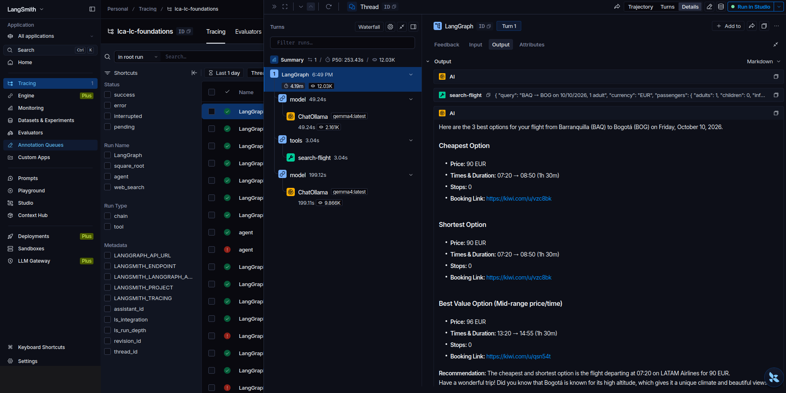

# M2.1b Travel Agent (MCP remoto)

## Resumen
- Segunda parte de [M2.1 MCP](M2.1-mcp.md): el agente usa un servidor MCP **remoto de verdad**, el de Kiwi.com (vuelos).
- Transporte **`streamable_http`** con una `url`. No hay `command` ni subproceso: el cliente habla HTTP con un servidor de un tercero en internet.
- No necesita API key. Las tools las define Kiwi, y el modelo tiene que inferir los argumentos (aeropuertos, fechas, pasajeros).

## Los tres tipos de servidor MCP vistos
| | Servidor propio (`2.1_mcp_server.py`) | Servidor de terceros local (`mcp_server_time`) | **Servidor remoto (Kiwi)** |
|---|---|---|---|
| Transporte | `stdio` | `stdio` | **`streamable_http`** |
| Configuración | `command` + `args` | `command` + `args` | **`url`** |
| Dónde corre | Subproceso en mi máquina | Subproceso en mi máquina | **En los servidores de Kiwi** |
| Quién lo mantiene | Yo | Un paquete de PyPI | Kiwi.com |
| Dependencias | Las del `.venv` | Las del `.venv` | Ninguna local, solo internet |

## Tools que expone Kiwi (listadas en vivo)
- `search-flight` (47 argumentos: ruta, fechas, pasajeros, escalas, horarios, equipaje…)
- `feedback-to-devs` (`text`): ⚠️ envía texto a los desarrolladores de Kiwi.

Ficha completa en [00 Catálogo MCP](../mcp-catalog.md).

## Adaptaciones al lab local
Convención en el notebook: las celdas **🔸 ORIGINAL DEL CURSO** quedan comentadas y explican por qué no se corren. Cada una va seguida de su celda **🟢 ADAPTADO LOCAL**, que también explica el motivo del cambio.

| Celda | Cambio | Motivo |
|---|---|---|
| Setup | `load_dotenv()` → `sys.path` + `local_model` | `local_model.py` está en la raíz del repo |
| Cliente MCP | **Sin cambios** | Es remoto y no depende del Python local |
| *(nueva)* | Lista las tools y sus argumentos | Para ver qué tiene que adivinar el modelo antes de llamarlas |
| Agente | `"gpt-5-nano"` → `get_model("gemma4:latest")` | Sin APIs de pago; gemma4 soporta tools |
| Invocación | `ainvoke` → `astream(stream_mode="updates")` | En CPU cada paso tarda; así se ve la tool y sus argumentos mientras corre |
| *(nueva)* | Segunda pregunta en el mismo thread (BAQ → BOG) | Probar con una ruta propia y verificar la memoria (`InMemorySaver`) |

- En el notebook **el checkpointer se mantiene**. Solo se quita cuando el agente se sirve con `langgraph dev` (ver [M1.7 Personal Chef](../module-1/M1.7-personal-chef.md)).
- `response` se obtiene con `await agent.aget_state(config)` para que las celdas originales `pprint(response)` sigan funcionando.

## Qué observar al correrlo
- **Argumentos del tool call:** ¿el modelo convirtió "San Francisco" y "Tokyo" en códigos IATA (SFO, NRT/HND)? ¿Puso bien la fecha (31 de marzo, año correcto)?
- **Tamaño de la respuesta de Kiwi:** si trae muchos vuelos, la segunda llamada al modelo va a ser lenta en CPU, igual que con Tavily.
- **"No follow up questions":** ¿el modelo respeta la orden o pregunta igual?

## Resultados

### 1er intento ❌: el modelo "olvidó" la pregunta
- Pregunta 1 (vuelo directo Barranquilla → Tokio, 31/10/2026): el modelo llamó `search-flight(flyFrom="Barranquilla", flyTo="Tokyo")` con **nombres de ciudad, no códigos IATA**, y Kiwi los aceptó. Devolvió rutas con 2 escalas (BAQ→PTY→JFK→HND, ~929 EUR). **No había vuelos directos**, pero eso no llegó a explicarse.
- **Ya en la pregunta 1** la respuesta final fue *"What is your departure city…?"*: una sola respuesta de Kiwi para un vuelo largo con muchos segmentos basta para pasar los 8.192 tokens, sin necesidad de historial.
- Pregunta 2 en el **mismo thread** (BAQ → BOG): el modelo llamó bien a `search-flight(flyFrom="BAQ", flyTo="BOG", departureDate="10/10/2026", sort="price")` y Kiwi devolvió **15 vuelos** (desde 90 EUR, directo).
- Pero la respuesta final fue *"What is your departure city, destination city, and what date…?"*, como si no hubiera leído nada.
- **Causa:** historial del thread + JSON de Kiwi > `num_ctx=8192`. Ollama **recorta el inicio del prompt**, justo donde están el system prompt y la pregunta, y el modelo solo ve un pedazo de JSON. En CPU, leer tanto texto además hace que la celda parezca "pegada".

### 2º intento ✅
Cambios: `num_ctx=32768`, solo la tool `search-flight`, thread nuevo (`"2"`) y un system prompt que pide las 3 mejores opciones.

| Paso (trace en LangSmith) | Tokens | Tiempo |
|---|---|---|
| model → decide `search-flight` | 2.161 | 49,2 s |
| tools → `search-flight` (Kiwi remoto) | — | 3,0 s |
| model → arma la respuesta | **9.866** | **199,1 s** |
| **Total** | **12.030** | **4,2 min** |

- **Confirmación de la causa:** la segunda llamada al modelo leyó **9.866 tokens**. Con el límite de 8.192 del primer intento **no cabía**.
- Respuesta: 3 opciones BAQ → BOG para el viernes 10/10/2026, con precio, horario, escalas y link de reserva. La más barata y la más corta: 90 EUR, 07:20 → 08:50, directo (LATAM).
- Detalles menores: repitió la misma opción como "más barata" y "más corta", y agregó un dato turístico que nadie pidió ("No follow up questions" no evita el relleno).
- El modelo convirtió bien "next Friday" en `10/10/2026` porque en la pregunta le di la fecha de hoy.

## 🧠 Lecciones aprendidas
| # | Problema | Causa | Solución | Regla |
|---|---|---|---|---|
| 1 | Kiwi respondió pero el modelo preguntó "¿ciudad de origen?" | Historial + JSON de la tool > `num_ctx=8192` → Ollama recorta el inicio del prompt | `num_ctx=32768`, thread nuevo, filtrar tools | Si el modelo "olvida" la pregunta justo después de una tool, revisar contexto desbordado (log de Ollama: `truncating input prompt`) |
| 2 | La celda parecía "pegada" | Miles de tokens de entrada en CPU (9.866 → 199 s) | Medir en LangSmith por paso | El trace muestra qué paso tarda y cuántos tokens leyó |
| 3 | `feedback-to-devs` en las tools | El servidor expone una tool que envía texto a Kiwi | `[t for t in tools if t.name == "search-flight"]` | Con MCP de terceros, pasar al agente solo las tools necesarias |
| 4 | "next Friday" bien resuelto | Le di la fecha actual en la pregunta | Incluir la fecha en el prompt o en el system prompt | Los LLM no saben qué día es hoy |

## Trampas para el examen
- Thread con checkpointer = el historial **crece en cada turno**, y con tools que devuelven mucho se llena el contexto rápido → context engineering (resumir o recortar mensajes).
- `stdio` = subproceso local (`command`, `args`); `streamable_http` = servidor remoto (`url`, opcionalmente `headers` para autenticación).
- Un mismo `MultiServerMCPClient` puede mezclar servidores `stdio` y `streamable_http`.
- Con un MCP remoto, **la seguridad la define el tercero**: el agente ejecuta tools que no controlas.

## Enlaces
- Curso: [_Curso](../module-1/README.md) · Anterior: [M2.1 MCP](M2.1-mcp.md) · Consolidado: [00 Lecciones aprendidas](../lecciones-aprendidas.md)
