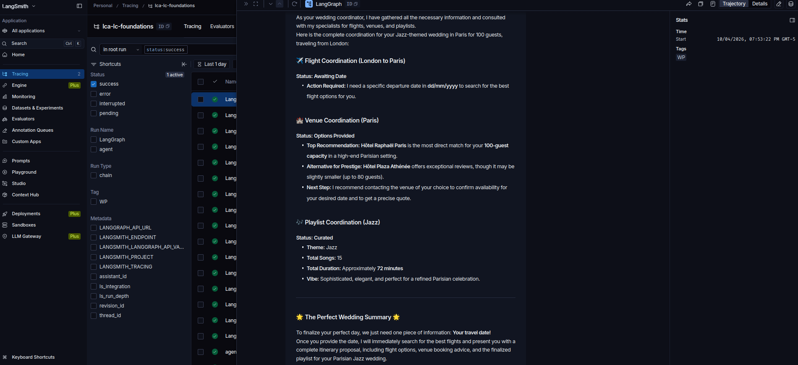

# M2.4 Wedding Planner (proyecto del módulo 2)

## Resumen
Proyecto que junta todo el módulo 2:

| Pieza | Lección | En el proyecto |
|---|---|---|
| MCP remoto | [M2.1b Travel Agent](M2.1b-travel-agent.md) | `travel_agent` usa Kiwi (`search-flight`) |
| Tool web | [M1.4 Web Search](../module-1/M1.4-web-search.md) | `venue_agent` usa Tavily (con límite de búsquedas) |
| Tool SQL | Bonus SQL | `playlist_agent` consulta `resources/Chinook.db` |
| State | [M2.2b State](M2.2b-state.md) | `WeddingState` (origin, destination, guest_count, genre) |
| Multi-agente | [M2.3 Multi-Agent](M2.3-multi-agent.md) | `coordinator` delega en los 3 subagentes vía tools que leen el state |

Flujo: el coordinador extrae los datos → `update_state` → luego `search_flights`, `search_venues` y `suggest_playlist` leen `runtime.state` → el coordinador integra todo.

## Ideas de robustez del curso (vale la pena reutilizarlas)
- **`RetryMCPInterceptor`** (`tool_interceptors=[...]` en `MultiServerMCPClient`): reintenta los errores transitorios de MCP con backoff exponencial y, en vez de lanzar excepciones, **devuelve el error como texto** al agente para que pueda corregir y reintentar.
- **Límite de búsquedas** dentro de la tool (`search_number` / `max_search_number`): la tool misma frena el bucle.
- **`recursion_limit=40`** en el `config` y **`tags=["WP"]`** para encontrar el trace en LangSmith.
- `update_state` "must be called alone": evita que el modelo llame en paralelo tools que dependen del state.

## Adaptaciones al lab local
| Celda | Cambio | Motivo |
|---|---|---|
| Setup | `sys.path` + `local_model` + `MODEL = get_model("gemma4:latest", num_ctx=32768)` | Kiwi y Tavily devuelven mucho texto; con 8K se pierde la pregunta ([M2.1b Travel Agent](M2.1b-travel-agent.md)) |
| *(nueva)* tras `get_tools()` | Solo `search-flight` | `feedback-to-devs` envía texto a Kiwi ([00 Catálogo MCP](../mcp-catalog.md)) |
| `web_search` | `tavily_client.search(query, max_results=3)` | Menos tokens por búsqueda |
| 4 agentes | `"gpt-5-nano"` → `MODEL` | Sin APIs de pago |

⚠️ En CPU este notebook es **largo** (decenas de llamadas al modelo): calcula entre 15 y 40 min. Sigue el progreso en LangSmith filtrando por el tag `WP`.

## 🎯 Para el examen: el setup de tools con `RetryMCPInterceptor`

### Qué hace la celda, en una frase
Conecta el cliente MCP a Kiwi y le agrega un **interceptor**: una capa que envuelve **cada llamada a una tool MCP** para reintentar los fallos transitorios y, si al final falla, **devolver el error como texto al agente** en lugar de romper la ejecución.

### Las piezas
| Pieza | Qué es |
|---|---|
| `tool_interceptors=[RetryMCPInterceptor()]` | Parámetro de `MultiServerMCPClient`: una **lista** de interceptores que se aplican a todas las tools del cliente, en cadena, como un middleware |
| `async def __call__(self, request, handler)` | La firma de un interceptor. `request` = la llamada (nombre de la tool y argumentos). `handler` = la función que **de verdad** ejecuta la llamada al servidor MCP |
| `return await handler(request)` | Deja pasar la llamada. El interceptor decide **antes y después**: reintentar, modificar la petición o transformar el resultado |
| `McpError` / `exc.error.code` | Error del protocolo MCP, con un **código JSON-RPC** |
| `CallToolResult(content=[TextContent(...)], isError=False)` | Un **resultado de tool fabricado** con el texto del error. El agente lo recibe como un `ToolMessage` normal |

### Códigos de error JSON-RPC (los que importan aquí)
| Código | Significado | ¿Reintentar? | Por qué |
|---|---|---|---|
| **-32603** | Internal error, falla del servidor | ✅ Sí, con backoff | Suele ser transitorio (servidor saturado o caído un momento) |
| **-32602** | Invalid params, argumentos inválidos | ❌ No | El error es **del modelo** (fecha mal formateada, aeropuerto inexistente): reintentar igual daría el mismo error. Se le devuelve el mensaje para que **corrija los argumentos** |
| Otra excepción (red, timeout, `fetch failed`) | Fallo de transporte | ✅ Sí | Problema de red, probablemente pasajero |

### Flujo con `max_retries=3`
```
intento 1 ── falla (-32603 o red) ── espera 2**0 = 1 s
intento 2 ── falla ───────────────── espera 2**1 = 2 s
intento 3 ── falla ──▶ devuelve "Tool call failed after 3 attempts: …" (texto al agente)

intento N ── falla con -32602 ──▶ devuelve de inmediato "Tool call failed (non-retryable): …"
intento N ── OK ──▶ devuelve el resultado real de Kiwi
```
- **Backoff exponencial** (`await asyncio.sleep(2 ** attempt)`): cada reintento espera el doble para no saturar a un servidor que ya está con problemas. Es async, así que no bloquea el event loop.

### La idea clave: errores como observación, no como excepción
- Si la tool **lanza una excepción**, el run del agente se cae.
- Si la tool **devuelve el error como texto**, el modelo lo **lee** y puede **adaptarse**: corregir argumentos, intentar otra búsqueda o explicarle al usuario que el servicio no responde.
- Por eso se usa `isError=False`: el resultado se trata como una respuesta normal de la tool, no como una excepción.
- La nota del propio curso lo resume: *"where possible, tool errors should be returned to the agent rather than failing so that the agent can adjust its invocation and try again"*.

### Dónde va cada cosa (para no confundir capas)
| Capa | Mecanismo | Alcance |
|---|---|---|
| **Cliente MCP** | `tool_interceptors` en `MultiServerMCPClient` | Solo las tools que vienen de ese cliente MCP |
| **Agente** | Middleware de `create_agent` (envolver las tool calls) — se ve en el módulo 3 | Todas las tools del agente, MCP o no |
| **Dentro de la tool** | `try/except` que devuelve texto, como `web_search` y `query_playlist_db` en este mismo notebook | Una tool puntual |

### Preguntas tipo examen
1. **¿Por qué no se reintenta un error -32602?** Porque son parámetros inválidos que generó el modelo: el mismo pedido fallaría igual. Hay que devolverle el error para que corrija.
2. **¿Qué ventaja tiene devolver `CallToolResult` con el error en vez de lanzar la excepción?** El agente no se cae y puede razonar sobre el error y reintentar con otros argumentos.
3. **¿Qué es `handler` en un interceptor?** La función que ejecuta la llamada real a la tool. El interceptor decide si la llama, cuántas veces y qué hace con el resultado.
4. **¿Para qué sirve el backoff exponencial?** Para espaciar los reintentos (1 s, 2 s, 4 s…) y no saturar un servicio que está fallando.
5. **¿Dónde se registran los interceptores?** En `MultiServerMCPClient(..., tool_interceptors=[...])`. Aplican a todas las tools de ese cliente.

### En mi lab
- Los `print("[MCP interceptor] …")` salen en la celda y permiten ver si Kiwi está fallando. En LangSmith, el reintento queda **dentro** del run de la tool (latencia mayor, un solo resultado).
- Después de `get_tools()` filtro para quedarme solo con `search-flight`. El interceptor sigue aplicándose, porque está en el cliente y no en la lista.

## Resultados (run con tag `WP`, gemma4 en CPU) ⚠️ parcial


Pedido: *"I'm from London and I'd like a wedding in Paris for 100 guests, jazz-genre"*. El run terminó con status **success**, pero el resultado quedó **incompleto**:

| Especialista | Resultado | Evaluación |
|---|---|---|
| ✈️ Vuelos (Kiwi) | *"I will assume the best time … is **May** … Please provide a specific departure date in dd/mm/yyyy"* | ❌ **No cumplió la consigna.** Eligió el mes (mayo) pero no armó una fecha concreta, no buscó en Kiwi y terminó preguntando, aunque el prompt decía "no follow up questions" |
| 🏰 Venues (Tavily) | Hôtel Raphaël Paris (recomendado para 100) y Hôtel Plaza Athénée (hasta ~80). Admitió que era difícil encontrar una capacidad exacta de 100 con precios públicos | ✅ Útil y honesto. Falta verificar los datos |
| 🎷 Playlist (SQL Chinook) | Tabla con 15 temas de jazz, duración y **precio ($0.99 c/u)**, ~72 min | ⚠️ El subagente sí calculó precios, pero puso los artistas como *"Jazz Artist (Inferred/Placeholder)"*: no hizo JOIN con la tabla `Artist`. El coordinador **omitió el costo** en el resumen final |
| 🎯 Coordinador | Primero `update_state` **solo**, después los 3 especialistas **en paralelo** (3 `ToolMessage` seguidos). Cerró pidiendo *"Your travel date!"* | ⚠️ Respetó el orden (state → delegar), pero pasó la pregunta al usuario y perdió datos al resumir |

### Referencia del curso (para comparar)
- Trace público del run original (con `gpt-5-nano`): https://smith.langchain.com/public/7b5fe668-d3e3-4af4-b513-a8cacc0c9e84/r
- Sirve para comparar paso a paso: cuántas búsquedas hizo cada subagente, qué fecha eligió el agente de vuelos y cuánto tardó, contra mi run local con tag `WP`.

**Por qué falló vuelos:**
- `search-flight` **exige `departureDate`**. El subagente solo recibe *"Find flights from London to Paris"* (origin y destination desde el state), sin fecha.
- Elegir una fecha "por criterio" (la mejor época para una boda en París) es razonamiento abierto. Un modelo de 8B en local tiende a **pedir el dato faltante** en vez de decidir, aunque el prompt diga "no follow up questions".
- Ya lo vimos en [M2.1b Travel Agent](M2.1b-travel-agent.md): los LLM no saben qué día es hoy, así que no pueden calcular una fecha futura válida.

**Cómo arreglarlo (para una segunda corrida):**
1. Agregar `wedding_date` al `WeddingState` y pedirlo en el mensaje inicial ("…in June 2027…"), o
2. Pasar la fecha en la tool: `f"Find flights from {origin} to {destination} on {date}"`, o
3. En el system prompt del travel agent: *"Today is <fecha>. If no date is given, pick a date 6 months from today in dd/mm/yyyy and search."*

**Lo que sí funcionó:**
- El coordinador llamó `update_state` **solo** y después los 3 especialistas **en paralelo** en un mismo paso, como pedía la docstring (*"must be called alone"*).
- El **state compartido**: `update_state` guardó origin/destination/guest_count/genre (London, Paris, "100", jazz) y las tools de los subagentes lo leyeron con `runtime.state`.
- El **multi-agente con 3 especialistas**, cada uno con su tool (MCP remoto, Tavily, SQL).
- El run terminó sin errores. El interceptor y el límite de búsquedas evitaron que se cayera o se quedara en bucle.

## 🧠 Lecciones aprendidas
| # | Problema | Causa | Solución | Regla |
|---|---|---|---|---|
| 1 | El agente de vuelos pidió la fecha en vez de buscar | La tool exige `departureDate`; el subagente no la recibe y un modelo chico no decide por su cuenta | Pasar la fecha en el state o la tool, o dar la fecha de hoy y una regla en el prompt | **Los datos obligatorios de una tool tienen que llegar al subagente**; no confiar en que el modelo los invente |
| 2 | Status "success" pero resultado incompleto | El grafo terminó sin excepciones; la calidad no se mide con el status | Evaluar el output (dominio Test): ¿hay vuelos? ¿hay costo de la playlist? | **Success ≠ correcto.** Hacen falta evaluadores |
| 3 | El costo de la playlist se perdió en el resumen | El subagente lo calculó, pero el coordinador lo omitió al resumir | Pedir al coordinador un formato de salida fijo (vuelos, venue, playlist: duración y costo) | **Cada salto de agente puede perder información**; definir el formato del resumen final |
| 5 | Artistas "Inferred/Placeholder" | El SQL no unió `Track → Album → Artist` | System prompt del playlist agent: "include artist name (JOIN Album and Artist)" | En text-to-SQL, revisar en el trace la query que generó el modelo |
| 4 | El coordinador pasó la pregunta al usuario | El subagente devolvió una pregunta como "resultado" | Validar las respuestas de los subagentes o reintentar con el dato | En multi-agente, un subagente débil degrada todo el resultado |

## 🎯 Para el examen (dominio Build): patrones del Wedding Planner
- **Coordinador + especialistas** (subagents as tools) con un **state compartido**:
  1. El coordinador extrae los datos de la conversación → `update_state` → `Command(update={...})`.
  2. Las tools-subagente leen ese state con `runtime.state[...]`. Los datos **no** viajan por el prompt, sino por el state.
  3. Cada subagente devuelve solo su respuesta final (aislamiento de contexto).
- **Orden de tools:** la docstring *"must be called alone"* + el system prompt (*"once that has completed and returned…"*) hacen que el modelo primero escriba el state y después delegue. Si el modelo las llamara en paralelo, los subagentes leerían un state vacío.
- **Tool async vs sync:** `search_flights` es `async` (usa `await travel_agent.ainvoke`, porque el MCP es async). `search_venues` y `suggest_playlist` son sync (`invoke`). El agente acepta ambas mezcladas cuando se invoca con `ainvoke`.
- **Robustez:**
  - `tool_interceptors=[RetryMCPInterceptor()]`: reintentos y errores como texto (ver la sección del interceptor).
  - Límite de búsquedas **dentro de la tool** (`search_number` > `max_search_number` → "Search limit reached…").
  - `try/except` en las tools que devuelve el error como texto (`web_search`, `query_playlist_db`).
  - `config={"recursion_limit": 40}`: tope de pasos del grafo (por defecto 25). Si se supera → `GraphRecursionError`.
  - `config={"tags": ["WP"]}`: etiqueta para filtrar el trace en LangSmith.
- **Text-to-SQL:** el system prompt pide *"Before writing any data queries, first discover the schema"*. El modelo consulta las tablas antes de escribir el SQL.
- **Preguntas trampa probables:**
  - *¿Cómo recibe el subagente el destino sin que el coordinador se lo diga en el prompt?* → desde el **state** (`runtime.state["destination"]`).
  - *¿Qué pasa si se supera `recursion_limit`?* → el grafo corta con `GraphRecursionError`.
  - *¿Status success significa que el resultado es correcto?* → No, hay que evaluarlo.

## Trampas para el examen
- **Status `success` ≠ tarea cumplida:** el run no falló, pero un subagente devolvió una pregunta. Para eso existen las evaluaciones (dominio Test).
- Tools que **leen** el state (`runtime.state[...]`) para pasar datos a los subagentes, sin repetirlos en el prompt.
- `tool_interceptors` en el cliente MCP para reintentos y manejo de errores.
- `recursion_limit` controla cuántos pasos puede dar el grafo (por defecto 25).

## Enlaces
- [_Curso](../module-1/README.md) · Anterior: [M2.3 Multi-Agent](M2.3-multi-agent.md) · Bonus: M2.B Bonus RAG y SQL
