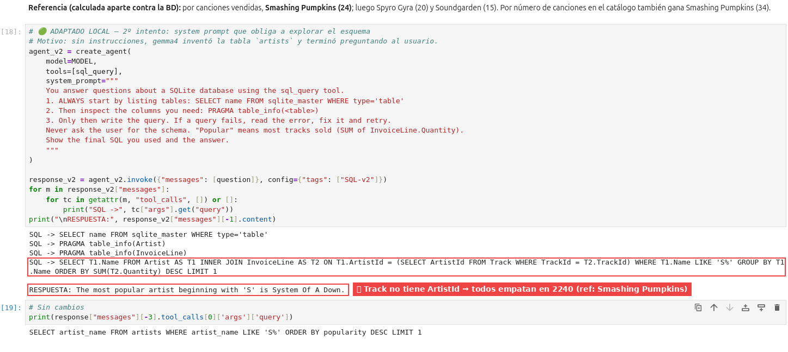
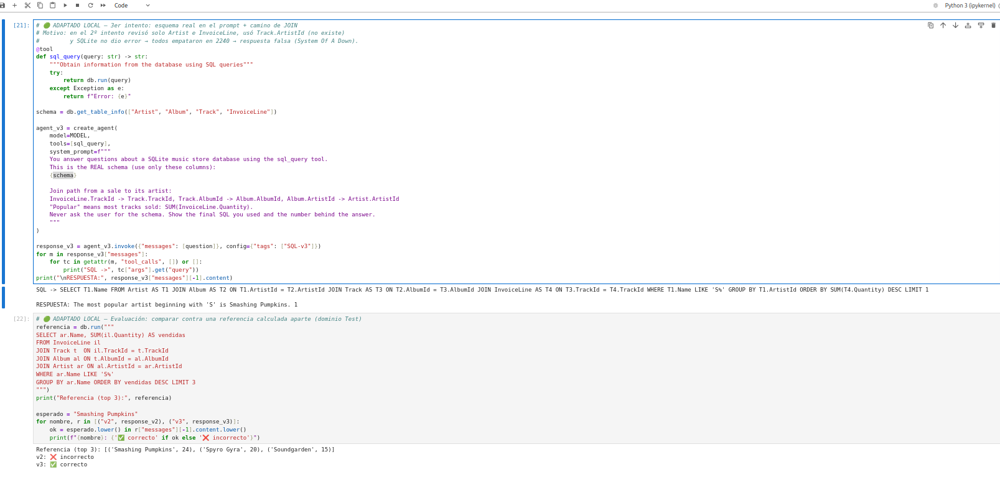

# M2.B Bonus: RAG y SQL

## RAG (`bonus_rag.ipynb`)
Pipeline: **PDF → chunks → embeddings → vector store → tool de búsqueda → agente**.
```python
loader = PyPDFLoader("resources/acmecorp-employee-handbook.pdf")
all_splits = RecursiveCharacterTextSplitter(chunk_size=1000, chunk_overlap=200, add_start_index=True).split_documents(loader.load())
embeddings = OllamaEmbeddings(model="nomic-embed-text", base_url=OLLAMA_URL)   # 🟢 local
vector_store = InMemoryVectorStore(embeddings)
vector_store.add_documents(all_splits)

@tool
def search_handbook(query: str) -> str:
    """Search the employee handbook for information"""
    return vector_store.similarity_search(query)[0].page_content
```
- **Requisito:** `ollama pull nomic-embed-text` en el servidor (768 dimensiones, corre bien en CPU).
- Ojo: la tool devuelve **solo el primer chunk** (`results[0]`). Si la respuesta está repartida en varios chunks, el agente no la ve. Mejora: unir los top-k.

## SQL (`bonus_sql.ipynb`)
- Tool `sql_query` sobre `resources/Chinook.db` (SQLite de una tienda de música: Artist, Album, Track, Invoice…).
- El agente escribe el SQL. La tool devuelve el error como texto, así el modelo puede corregir la consulta.
- ⚠️ La tool ejecuta **cualquier SQL** (también `DELETE`/`DROP`). En producción: usuario de solo lectura o validar que sea `SELECT`.

## ⚠️ `langchain-community` en retiro (DeprecationWarning)
Al importar `from langchain_community.utilities import SQLDatabase` (también `PyPDFLoader`) sale:
```
DeprecationWarning: `langchain-community` is being sunset and is no longer actively maintained.
See https://github.com/langchain-ai/langchain-community/issues/674
```
- Es un **aviso, no un error**: el código funciona igual y el notebook puede seguir.
- **Qué significa:** LangChain dejó de mantener el paquete "todo en uno" `langchain-community`. Las integraciones pasan a **paquetes propios** (como `langchain-ollama`, `langchain-tavily` o `langchain-openai`), a **implementarse en el propio código** o a **consumirse vía MCP**.
- **Para `SQLDatabase` y `PyPDFLoader` el anuncio no da un reemplazo puntual.** En el curso se siguen usando así.
- **Alternativas si en el futuro deja de funcionar:**
  - SQL: tool propia con `sqlite3` o SQLAlchemy (`SELECT` de solo lectura).
  - PDF: `pypdf` directo y armar los `Document` a mano.
- **Para el examen:** las integraciones viven en **paquetes por proveedor** (`langchain-<proveedor>`), y `langchain-community` es legado. En la doc de *integrations* se ve qué paquete usar.

### Paquetes por proveedor: qué cambia y qué no
**Antes:** casi todas las integraciones (Ollama, OpenAI, Tavily, Chroma, lectores de PDF, SQL…) venían en un solo paquete, `langchain-community`, que LangChain mantenía para todos los proveedores.
**Ahora:** cada proveedor tiene su paquete `langchain-<proveedor>`, mantenido por LangChain y el proveedor, con su propio ritmo de versiones.

| Integración | Antes (legado) | Ahora (paquete del proveedor) |
|---|---|---|
| Chat con Ollama | `from langchain_community.chat_models import ChatOllama` | `from langchain_ollama import ChatOllama` ← mi `local_model.py` |
| Embeddings con Ollama | `langchain_community.embeddings` | `from langchain_ollama import OllamaEmbeddings` ← bonus RAG |
| Tavily | `langchain_community.tools.TavilySearchResults` | `from langchain_tavily import TavilySearch` |
| Chroma | `langchain_community.vectorstores` | `from langchain_chroma import Chroma` |
| `PyPDFLoader`, `SQLDatabase` | `langchain_community` | Todavía sin paquete propio → por eso sale el aviso |

**Qué NO cambia:** todas cumplen las mismas **interfaces de `langchain-core`**: un chat model tiene `.invoke()`, unos embeddings `.embed_query()`, un vector store `.similarity_search()`. Cambian el `pip install` y la línea del `import`; `create_agent`, las tools y el resto del código quedan igual. Por eso pasar de `OpenAIEmbeddings` a `OllamaEmbeddings` fue cambiar una línea.

**🎯 Para el examen:** integraciones = paquetes `langchain-<proveedor>`; `langchain-community` = legado; la portabilidad entre proveedores viene de las interfaces de `langchain-core`.

## Recursos de `resources/` que usan los notebooks
| Archivo | Usado por |
|---|---|
| `2.1_mcp_server.py` | `2.1_mcp.ipynb` (servidor MCP local) |
| `acmecorp-employee-handbook.pdf` | `bonus_rag.ipynb` |
| `Chinook.db` | `bonus_sql.ipynb`, `2.4_wedding_planners.ipynb` |

Las rutas son relativas (`resources/...`), así que el notebook debe correr desde `notebooks/module-2/`.

## Adaptaciones al lab local
| Notebook | Cambio | Motivo |
|---|---|---|
| Ambos | `sys.path` + `local_model` + `MODEL` | `local_model.py` en la raíz |
| RAG | `OpenAIEmbeddings` → `OllamaEmbeddings("nomic-embed-text")` | Sin APIs de pago |
| RAG y SQL | `"gpt-5-nano"` → `MODEL` | Sin APIs de pago |
| SQL | `num_ctx=16384` | El esquema de la BD y los resultados ocupan contexto |

## Resultados RAG (gemma4 + nomic-embed-text, CPU) ✅
| Paso | Resultado |
|---|---|
| `PyPDFLoader` | 1 `Document` (1 página, **1.943 caracteres**): políticas de NDA, conducta, PTO y viajes |
| `RecursiveCharacterTextSplitter(1000, 200)` | **3 chunks** |
| `OllamaEmbeddings("nomic-embed-text")` | Vectores de **768 dimensiones** |
| `similarity_search("How many days of vacation… first year?")` | Top-1 = chunk 2 (`start_index: 812`), la política de **PTO** ✅ |
| Agente | 1 tool call. El modelo **reescribió la búsqueda** a `'vacation days first year'` y respondió: *"full-time employees accrue **10 days** of PTO per year for the first 0–1 years of service"* ✅ |
| Costo | Llamada 1 (decidir la tool): 92 → 26 tokens, 3,2 s. Llamada 2 (responder con el chunk): 353 → 35 tokens, 7,3 s. **~10,5 s en total** |

### ¿Por qué solo 3 chunks?
- El PDF es chico: **1.943 caracteres**. `chunk_size` se mide en **caracteres**, no en tokens.
- Con `chunk_size=1000` y `chunk_overlap=200`, cada chunk avanza unos 800 caracteres → 1.943 / 800 ≈ **3 chunks**.
- `add_start_index=True` guarda en la metadata dónde empieza cada chunk en el texto original (el chunk 2 empieza en el carácter 812). Sirve para citar la fuente.
- Los 200 caracteres de solapamiento evitan cortar una idea a la mitad: el final de un chunk se repite al inicio del siguiente.

### ¿Dónde está la base de datos vectorial?
**No hay una base de datos aparte.** `InMemoryVectorStore` guarda los vectores en la **memoria RAM del kernel de Jupyter**, en un diccionario de Python.
- No se escribe nada en disco y no hay servidor. Si reinicias el kernel, se pierde y hay que volver a generar los embeddings.
- Busca comparando la pregunta contra **todos** los vectores (similitud coseno). Con 3 chunks es instantáneo; con millones no escala.
- Sirve para aprender y para prototipos. En producción se cambia por un vector store persistente, con la misma interfaz de LangChain (`add_documents`, `similarity_search`, `as_retriever`):

| Vector store | Dónde vive | Para qué |
|---|---|---|
| `InMemoryVectorStore` | RAM del proceso | Pruebas y notebooks (este curso) |
| FAISS | Archivo local (`save_local`) | Lab local, sin servidor |
| Chroma | Carpeta local o servidor | Lab local con persistencia |
| pgvector (PostgreSQL) | Base de datos | Si ya hay PostgreSQL |
| Qdrant, Pinecone, Weaviate | Servidor o nube | Producción a escala |

**Ojo:** el modelo de embeddings que indexa y el que consulta deben ser **el mismo** (aquí `nomic-embed-text`, 768 dimensiones). Si cambias de modelo, hay que reindexar.

### Detalles que se vieron en la salida
- Ruido de extracción del PDF: `Full■time` y `\x7f` en lugar de viñetas. No afectó la búsqueda, pero en documentos técnicos conviene limpiar el texto antes de partirlo.
- La tool devuelve solo `results[0]`. Funcionó porque la respuesta estaba entera en un chunk. Con documentos grandes conviene unir los top-k.
- En el repo público la tool se llama `search_handbook`, como en el curso. Lo renombré para no publicar nombres personales.


## Resultados SQL — 1er intento (sin system prompt) ❌
Pregunta del curso: *"Who is the most popular artist beginning with 'S' in this database?"*

| Paso | Qué hizo gemma4 |
|---|---|
| 1 | Sin mirar el esquema, **inventó** tabla y columnas: `SELECT artist_name FROM artists WHERE artist_name LIKE 'S%' ORDER BY popularity DESC LIMIT 1` |
| 2 | La tool devolvió el error como texto: `no such table: artists` ✅ (el patrón `try/except` funcionó) |
| 3 | En vez de explorar el esquema y reintentar, **le preguntó al usuario** por las tablas ❌ |

- **Prueba directa de la tool:** `sql_query.invoke("SELECT * FROM Artist LIMIT 10")` devuelve AC/DC, Accept, Aerosmith… ✅. **La tool y la BD funcionan; el que falla es el SQL que escribe el modelo.** Probar la tool aislada separa el error de infraestructura del error del LLM.
- Esquema real: `Album, Artist, Customer, Employee, Genre, Invoice, InvoiceLine, MediaType, Playlist, PlaylistTrack, Track`. La tabla es `Artist` (singular) con `Name`, y no existe ninguna columna `popularity`.
- Costo: 2 llamadas al modelo, ~15 s (7 s fueron de carga del modelo).
- **"Popular" es ambiguo.** Referencia calculada contra la BD:

| Definición de "popular" | Ganador con 'S' |
|---|---|
| Canciones vendidas (`SUM(InvoiceLine.Quantity)`) | **Smashing Pumpkins (24)**, luego Spyro Gyra (20) y Soundgarden (15) |
| Canciones en el catálogo | Smashing Pumpkins (34), luego Santana (27) |
| Álbumes | Santana (3) |

**2º intento (tag `SQL-v2`, system prompt de exploración del esquema):** ❌ respuesta incorrecta, pero sin errores.



| Paso | SQL de gemma4 | Evaluación |
|---|---|---|
| 1 | `SELECT name FROM sqlite_master WHERE type='table'` | ✅ Siguió el prompt |
| 2-3 | `PRAGMA table_info(Artist)`, `PRAGMA table_info(InvoiceLine)` | ⚠️ **No revisó `Track` ni `Album`**, que son el puente entre venta y artista |
| 4 | `... ON T1.ArtistId = (SELECT ArtistId FROM Track WHERE TrackId = T2.TrackId) ...` | ❌ `Track` **no tiene** `ArtistId`. SQLite no da error: toma `ArtistId` del `Artist` de afuera (subconsulta correlacionada) → la condición es **siempre verdadera** → cada artista se cruza con **todas** las ventas |

- Resultado: todos los artistas con S empatan en **2240** (el total de ventas de toda la BD), y el `LIMIT 1` devuelve **System Of A Down** por azar del orden. Referencia correcta: **Smashing Pumpkins (24)**.
- El camino correcto es `InvoiceLine → Track → Album → Artist`.
- **Es el error más peligroso de text-to-SQL:** el SQL corre, la respuesta suena segura y está mal. Solo se detecta comparando contra una referencia o revisando el SQL.

**3er intento (tag `SQL-v3`, esquema real en el prompt + camino de JOIN):** ✅ correcto.



```python
schema = db.get_table_info(["Artist", "Album", "Track", "InvoiceLine"])
# system_prompt: schema real + "InvoiceLine.TrackId -> Track.TrackId, Track.AlbumId -> Album.AlbumId,
#                Album.ArtistId -> Artist.ArtistId" + "Popular = SUM(InvoiceLine.Quantity)"
```
- SQL de gemma4 (una sola query, sin errores):
  `SELECT T1.Name FROM Artist T1 JOIN Album T2 ON T1.ArtistId=T2.ArtistId JOIN Track T3 ON T2.AlbumId=T3.AlbumId JOIN InvoiceLine T4 ON T3.TrackId=T4.TrackId WHERE T1.Name LIKE 'S%' GROUP BY T1.ArtistId ORDER BY SUM(T4.Quantity) DESC LIMIT 1`
- Respuesta: **Smashing Pumpkins** ✅.
- ⚠️ Detalle: el prompt pedía "el número detrás de la respuesta", pero el SQL no seleccionó `SUM(...)` y el modelo escribió un "1" suelto. El nombre es correcto; el número, no (son 24).

**Evaluación automática (celda nueva):** referencia calculada con SQL fijo → `[('Smashing Pumpkins', 24), ('Spyro Gyra', 20), ('Soundgarden', 15)]`. Resultado: **v2 ❌ · v3 ✅**.

### Evolución de los 3 intentos
| | Esquema | SQL | Respuesta | Evaluación |
|---|---|---|---|---|
| v1 (curso, sin system prompt) | Inventado (`artists.popularity`) | Error `no such table` | Preguntó al usuario | ❌ |
| v2 (explorar el esquema) | Exploró 2 de 4 tablas | Corre, pero une por `Track.ArtistId` (no existe) | *System Of A Down* (falso, empate en 2240) | ❌ |
| v3 (esquema real + camino de JOIN) | Dado en el prompt | 3 JOIN correctos | **Smashing Pumpkins** | ✅ |

> **Qué funcionó:** no dejar que el modelo adivine. Darle el esquema exacto con `db.get_table_info()` y el camino de JOIN, y verificar con un evaluador contra un valor de referencia. Es la escalera de control de [M2.4 Wedding Planner](M2.4-wedding-planner.md): más contexto determinístico → menos libertad para equivocarse.

## 🧠 Lecciones aprendidas
| # | Problema u observación | Causa | Solución | Regla |
|---|---|---|---|---|
| 1 | "¿Dónde está la BD vectorial?" | `InMemoryVectorStore` vive en la RAM del kernel | Para persistir: FAISS o Chroma (local), pgvector o Qdrant (servidor) | **InMemory = prototipo.** Reiniciar el kernel obliga a reindexar |
| 2 | Solo 3 chunks | Documento de 1.943 caracteres; `chunk_size` está en caracteres | Ajustar `chunk_size` y `chunk_overlap` al tamaño y tipo de documento | El número de chunks depende del texto, no es un parámetro |
| 3 | La tool usa solo el top-1 | `results[0].page_content` | Unir los top-k (`k=4` por defecto) o usar `as_retriever(search_kwargs={"k": 3})` | Si la respuesta está repartida en varios chunks, top-1 no alcanza |
| 4 | El agente reescribió la pregunta | El LLM arma los argumentos de la tool | Nada: es una ventaja del RAG como tool (*agentic RAG*) | La búsqueda la decide el modelo; revisar los args en el trace |
| 5 | Caracteres raros (`■`, `\x7f`) | Extracción de texto del PDF | Limpiar el texto antes de partirlo | La calidad del RAG empieza en la carga del documento |
| 6 | El agente inventó el esquema (`artists`, `popularity`) | Sin system prompt, un modelo chico no explora antes de consultar | Prompt: listar tablas → `PRAGMA table_info` → consultar; o pasar `db.get_table_info()` en el prompt | **En text-to-SQL, el esquema es contexto obligatorio** (igual que en el Wedding Planner) |
| 7 | Ante el error, preguntó al usuario en vez de reintentar | El modelo no sabía que podía explorar | "Never ask the user for the schema; fix and retry" | Decir explícitamente qué hacer ante un error |
| 8 | "Most popular" se puede responder de 3 maneras | Pregunta ambigua | Definir la métrica en el prompt o en la tool | Sin definición, no hay respuesta correcta que evaluar |
| 9 | 2º intento: SQL válido, respuesta falsa (System Of A Down) | Revisó solo 2 tablas y usó `Track.ArtistId`, que no existe; SQLite lo resolvió contra la tabla externa → empate total | Pedir que inspeccione **todas** las tablas del camino de JOIN; dar el esquema completo (`db.get_table_info()`) o few-shot; evaluar contra la referencia | **Sin error ≠ correcto.** En SQL, una subconsulta correlacionada mal hecha devuelve datos sin quejarse |
| 10 | v3 correcto con una sola query | El esquema real y el camino de JOIN eliminan la adivinanza | `db.get_table_info([tablas])` en el system prompt | **Dar el esquema funciona mejor que pedir que lo explore** (con modelos chicos) |
| 11 | La evaluación detectó el error de v2 | Comparar la salida contra una referencia con SQL fijo | Celda evaluadora: caso + referencia + comparación | **Evaluador = caso de prueba + valor esperado + chequeo** (anticipo del curso 03) |
| 12 | Pidió "el número" y escribió "1" | El SQL no seleccionó `SUM(...)`; el modelo rellenó | Pedir explícitamente la columna del total en el SELECT | Si el dato no está en el resultado de la tool, el modelo lo inventa |

## 🎯 Para el examen (dominio Build: RAG)
- **Pipeline:** *document loader* → *text splitter* → *embeddings* → *vector store* → *retriever* o tool → agente.
- `RecursiveCharacterTextSplitter`: corta primero por párrafos, luego líneas, luego palabras. `chunk_size` y `chunk_overlap` se miden en **caracteres**. `add_start_index=True` agrega la posición en la metadata.
- `similarity_search(query, k=4)` devuelve una lista de **`Document`** (`page_content` + `metadata`), no texto plano.
- `vector_store.as_retriever()` convierte el store en un *retriever* (interfaz `invoke(query)`).
- **RAG como tool (agentic RAG)** frente a **RAG en 2 pasos** (siempre buscar y luego responder): con la tool el modelo decide si buscar y con qué texto, y puede buscar varias veces; cuesta una llamada extra al modelo.
- Embeddings: mismo modelo para indexar y para consultar; la dimensión la fija el modelo (768 en `nomic-embed-text`, 3.072 en `text-embedding-3-large`).
- **Preguntas trampa probables:**
  - *¿`InMemoryVectorStore` persiste?* → No.
  - *¿`chunk_size` es en tokens?* → No, en caracteres (con este splitter).
  - *¿Qué devuelve `similarity_search`?* → `Document`s.

## 🎯 Para el examen (dominio Build: text-to-SQL)
- El agente SQL del curso es **una sola tool** (`db.run(query)`) con `try/except` que devuelve el error como texto → el modelo puede corregir.
- La tool ejecuta **cualquier SQL**: en producción, usuario de solo lectura o validar que sea `SELECT` (*guardrail*).
- Dar el esquema (`db.get_table_info()`) o pedir que lo descubra; definir métricas ambiguas.
- Revisar en el trace el SQL generado y compararlo con una respuesta de referencia (dominio Test).
- **Patrón ganador con modelos chicos:** `db.get_table_info([...])` en el system prompt + camino de JOIN explícito. Explorar el esquema por tools es más frágil (puede revisar tablas de menos).
- **Evaluación mínima:** pregunta fija + referencia calculada con SQL determinístico + comparación → detectó que v2 era falso y v3 correcto.

## Dónde está en la doc
- RAG: https://docs.langchain.com/oss/python/langchain/rag
- SQL agent: https://docs.langchain.com/oss/python/langchain/sql-agent

## Enlaces
- Anterior: [M2.4 Wedding Planner](M2.4-wedding-planner.md)
